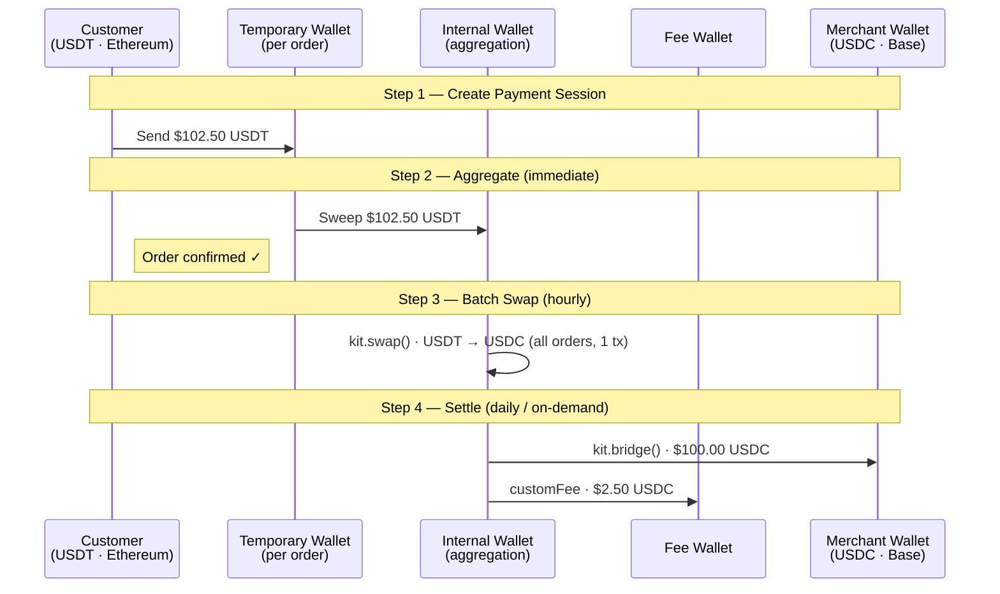

# Stablecoin Acquiring with Aggregation & Batch Processing

## Business Case

Stablecoin acquiring is the process of collecting payments from customers who pay with different tokens across different chains, and settling the equivalent value in USDC to the merchant. A customer might pay with USDT on Ethereum, another with DAI on Polygon, and another with native ETH — while every merchant receives clean USDC on their preferred chain, with a platform fee deducted automatically. At scale, payments are aggregated into a shared internal wallet, converted to USDC in hourly batches, and settled to merchants daily or on demand.

### Who This Is For

- **Payment Service Providers (PSPs)** — building crypto acquiring infrastructure for merchant networks
- **E-commerce platforms** — adding multi-token crypto checkout to an existing payment stack
- **Fintech companies** — launching a stablecoin payment product with built-in fee monetization

### Key Features

- **Multi-token payment acceptance** — accept USDT, DAI, ETH, or any supported token without managing per-token contract addresses
- **Temporary wallets per payment** — each order gets a dedicated address, keeping funds isolated until aggregation
- **Batch swaps for cost efficiency** — all tokens of the same type are converted to USDC in a single hourly transaction, saving 80–90% in gas vs per-payment swaps
- **Built-in platform fee collection** — fees are deducted within the same bridge transaction using the `customFee` parameter, no separate transfer needed
- **Cross-chain merchant settlement** — `kit.bridge()` delivers USDC to the merchant's preferred chain in one call
- **Flexible settlement schedule** — daily, weekly, or on-demand payouts without changing any code

> **Note**: This example uses Circle Wallet for illustration. You can use any wallet adapter (Viem, Ethers, or custom) with App Kit.

---

## Fund Flow Diagram



---

## Code Walkthrough

### Step 1: Setup & Configuration

**What this does:**
- Sets platform fee percentage to 2.5%
- Configures session expiry time
- Initializes App Kit SDK
- Creates adapter for internal wallet using Circle Wallet

> **Note**: This example uses Circle Wallet adapter for built-in wallet management. You can replace it with your own wallet adapter (Viem, Ethers, or custom implementation) based on your infrastructure.

```typescript
import { StablecoinKit } from '@circle-fin/stablecoin-kit';
import { createCircleWalletAdapter } from '@circle-fin/adapter-circle-wallet';

// Configuration
const PLATFORM_FEE_PERCENT = 2.5;
const SESSION_EXPIRY_MINUTES = 15;

// Initialize SDK
const kit = new StablecoinKit();
const internalWalletAdapter = createCircleWalletAdapter({
  apiKey: process.env.CIRCLE_API_KEY,
  walletId: process.env.INTERNAL_WALLET_ID,
  entitySecret: process.env.CIRCLE_ENTITY_SECRET
});
```

---

### Step 2: Create Payment Session

**What this does:**
- Creates a unique temporary wallet for each order
- Calculates total charge including platform fee (order amount + 2.5%)
- Returns payment address and session details
- Session expires in 15 minutes if payment not received

**Customer sees:**
```
Send 102.50 USDT to:
0x7a250d5d64a2d...
Expires in 15 minutes
```

```typescript
async function createPaymentSession(order: PaymentOrder): Promise<PaymentSession> {
  // Create temporary wallet for this payment
  const tempWallet = await internalWalletAdapter.createWallet({
    name: `Payment-${order.orderId}`,
    blockchain: order.customerChain
  });

  const amounts = calculateAmounts(order.orderAmount);

  return {
    sessionId: `session_${order.orderId}`,
    paymentAddress: tempWallet.address,
    walletId: tempWallet.id,
    expectedAmount: amounts.total.toFixed(2),
    expectedToken: order.customerToken,
    expiresAt: new Date(Date.now() + SESSION_EXPIRY_MINUTES * 60 * 1000)
  };
}
```

---

### Step 3: Monitor for Payment

**What this does:**
- Polls Circle Wallet API every 5 seconds to check balance
- Verifies if payment address received the expected amount
- Returns `true` when payment is confirmed
- Times out after 5 minutes if payment not received
- Provides progress updates every minute

```typescript
async function monitorPayment(session: PaymentSession): Promise<boolean> {
  const maxAttempts = 60; // Poll for 5 minutes

  for (let attempt = 0; attempt < maxAttempts; attempt++) {
    // Check wallet balance using Circle Wallet API
    const balance = await internalWalletAdapter.getBalance({
      walletId: session.walletId,
      token: session.expectedToken
    });

    if (parseFloat(balance.amount) >= parseFloat(session.expectedAmount)) {
      return true; // Payment received!
    }

    await new Promise(resolve => setTimeout(resolve, 5000)); // Wait 5 seconds
  }

  return false; // Timeout
}
```

---

### Step 4: Aggregate to Internal Wallet

**What this does:**
- Creates adapter for the temporary payment wallet
- Sweeps all funds from temporary wallet to internal wallet
- Happens immediately after payment is detected
- Returns transaction hash for tracking
- Customer order is confirmed at this point

**Result:** Customer receives instant order confirmation!

```typescript
async function aggregateToInternalWallet(
  order: PaymentOrder,
  session: PaymentSession
): Promise<string> {
  // Create adapter for temporary payment wallet
  const tempPaymentAdapter = createCircleWalletAdapter({
    apiKey: process.env.CIRCLE_API_KEY,
    walletId: session.walletId,
    entitySecret: process.env.CIRCLE_ENTITY_SECRET
  });

  // Transfer from temporary wallet to internal wallet
  const result = await kit.send({
    from: { adapter: tempPaymentAdapter, chain: order.customerChain },
    to: INTERNAL_WALLET_ID,
    amount: calculateAmounts(order.orderAmount).total.toFixed(2),
    token: order.customerToken
  });

  return result.txHash;
}
```

---

### Step 5: Batch Swap (Hourly Job)

**What this does:**
- Runs as a scheduled job (e.g., every hour via cron)
- Calculates total amount of each token type from all pending orders
- Swaps ALL accumulated tokens to USDC in ONE transaction per token
- Saves 80-90% gas compared to individual swaps
- Skips swap if token is already USDC

**Example:** 50 orders paid with USDT → 1 swap transaction instead of 50 (98% gas savings: $750 → $15)

```typescript
async function batchSwapToUSDC(
  chain: string,
  token: string,
  orders: PaymentOrder[]
): Promise<string> {
  const totalAmount = orders.reduce((sum, o) => {
    return sum + calculateAmounts(o.orderAmount).total;
  }, 0);

  // Swap all accumulated tokens in ONE transaction
  const result = await kit.swap({
    from: { adapter: internalWalletAdapter, chain },
    tokenIn: token,
    tokenOut: 'USDC',
    amount: totalAmount.toFixed(2),
    config: {
      kitKey: process.env.KIT_KEY,
      slippageBps: 50
    }
  });

  return result.txHash;
}
```

---

### Step 6: Settlement (Daily or On-Demand)

**What this does:**
- Runs daily or when merchant requests withdrawal
- Calculates total amount owed to merchant from multiple orders
- Bridges funds to merchant's preferred chain
- Collects platform fees using `customFee` parameter (no separate transaction!)
- Uses SLOW transfer mode for cost savings
- Returns all transaction hashes for tracking

**Example:** Merchant has 10 orders totaling $1,000 → 1 bridge transaction + fee collection (instead of 11 separate transactions)

```typescript
async function settleMerchant(
  merchant: MerchantConfig,
  orders: PaymentOrder[]
): Promise<string[]> {
  const totalAmount = orders.reduce((sum, o) =>
    sum + calculateAmounts(o.orderAmount).baseAmount, 0
  );
  const totalFees = orders.reduce((sum, o) =>
    sum + calculateAmounts(o.orderAmount).fee, 0
  );

  // Bridge with fee collection in ONE transaction
  const bridgeResult = await kit.bridge({
    from: { adapter: internalWalletAdapter, chain: 'Ethereum' },
    to: {
      adapter: internalWalletAdapter,
      chain: merchant.settlementChain,
      recipientAddress: merchant.settlementAddress
    },
    amount: totalAmount.toFixed(2),
    config: {
      transferSpeed: 'SLOW',
      customFee: {
        value: totalFees.toFixed(2),
        recipientAddress: PLATFORM_FEE_WALLET
      }
    }
  });

  return bridgeResult.steps.map(s => s.txHash);
}
```

---

## Complete Example Script

### Prerequisites

```bash
# Install dependencies
npm install @circle-fin/stablecoin-kit @circle-fin/adapter-circle-wallet dotenv

# Create .env file
touch .env
```

### Environment Variables

> **Note**: This example uses Circle Wallet for illustration purposes. If you're using your own wallet infrastructure, replace these with your wallet provider's configuration.
>
> **Circle Wallet Setup**: To get your Circle API credentials, see the [Circle Wallet Quickstart Guide](https://developers.circle.com/w3s/docs/programmable-wallets-quickstart). You'll need:
> - API Key from the [Circle Console](https://console.circle.com/)
> - Entity Secret generated during account setup
> - Wallet ID after creating your first wallet

```bash
# .env
CIRCLE_API_KEY=your_circle_api_key
INTERNAL_WALLET_ID=your_internal_wallet_id
CIRCLE_ENTITY_SECRET=your_entity_secret
KIT_KEY=your_circle_kit_key
PLATFORM_FEE_ADDRESS=0xYourFeeWallet
```

### Full Code

```typescript
import 'dotenv/config';
import { StablecoinKit } from '@circle-fin/stablecoin-kit';
import { createCircleWalletAdapter } from '@circle-fin/adapter-circle-wallet';

// Configuration
const PLATFORM_FEE_PERCENT = 2.5;
const SESSION_EXPIRY_MINUTES = 15;
const SLIPPAGE_BPS = 50;

// Initialization
const kit = new StablecoinKit();
const internalWalletAdapter = createCircleWalletAdapter({
  apiKey: process.env.CIRCLE_API_KEY as string,
  walletId: process.env.INTERNAL_WALLET_ID as string,
  entitySecret: process.env.CIRCLE_ENTITY_SECRET as string
});

const INTERNAL_WALLET_ID = process.env.INTERNAL_WALLET_ID as string;
const PLATFORM_FEE_WALLET = process.env.PLATFORM_FEE_ADDRESS as string;

// Helper function
function calculateAmounts(orderAmount: string) {
  const baseAmount = parseFloat(orderAmount);
  const fee = baseAmount * PLATFORM_FEE_PERCENT / 100;
  const total = baseAmount + fee;
  return { baseAmount, fee, total };
}

// Step 1: Create payment session
async function createPaymentSession(orderId: string, orderAmount: string, token: string, chain: string) {
  const tempWallet = await internalWalletAdapter.createWallet({
    name: `Payment-${orderId}`,
    blockchain: chain
  });

  const amounts = calculateAmounts(orderAmount);

  console.log(`\n✓ Payment session created`);
  console.log(`  Send ${amounts.total.toFixed(2)} ${token} to:`);
  console.log(`  ${tempWallet.address}`);

  return {
    sessionId: `session_${orderId}`,
    paymentAddress: tempWallet.address,
    walletId: tempWallet.id,
    expectedAmount: amounts.total.toFixed(2),
    expectedToken: token,
    expiresAt: new Date(Date.now() + SESSION_EXPIRY_MINUTES * 60 * 1000)
  };
}

// Step 2: Monitor payment
async function monitorPayment(session: any) {
  console.log(`\n⏳ Monitoring for payment...`);

  for (let attempt = 0; attempt < 60; attempt++) {
    const balance = await internalWalletAdapter.getBalance({
      walletId: session.walletId,
      token: session.expectedToken
    });

    if (parseFloat(balance.amount) >= parseFloat(session.expectedAmount)) {
      console.log(`  ✓ Payment received!`);
      return true;
    }

    await new Promise(resolve => setTimeout(resolve, 5000));
  }

  return false;
}

// Step 3: Aggregate to internal wallet
async function aggregateToInternalWallet(session: any, orderAmount: string, chain: string, token: string) {
  const tempPaymentAdapter = createCircleWalletAdapter({
    apiKey: process.env.CIRCLE_API_KEY as string,
    walletId: session.walletId,
    entitySecret: process.env.CIRCLE_ENTITY_SECRET as string
  });

  const amounts = calculateAmounts(orderAmount);

  const result = await kit.send({
    from: { adapter: tempPaymentAdapter, chain },
    to: INTERNAL_WALLET_ID,
    amount: amounts.total.toFixed(2),
    token
  });

  console.log(`\n✓ Aggregated to internal wallet`);
  console.log(`  TX: ${result.txHash}`);

  return result.txHash;
}

// Step 4: Batch swap (hourly job)
async function batchSwapToUSDC(chain: string, token: string, totalAmount: number) {
  if (token === 'USDC') {
    console.log(`\n✓ Already in USDC, no swap needed`);
    return 'no-swap';
  }

  const result = await kit.swap({
    from: { adapter: internalWalletAdapter, chain },
    tokenIn: token,
    tokenOut: 'USDC',
    amount: totalAmount.toFixed(2),
    config: {
      kitKey: process.env.KIT_KEY as string,
      slippageBps: SLIPPAGE_BPS
    }
  });

  console.log(`\n✓ Batch swap completed`);
  console.log(`  ${token} → USDC: ${totalAmount.toFixed(2)}`);
  console.log(`  TX: ${result.txHash}`);

  return result.txHash;
}

// Step 5: Settle to merchant
async function settleMerchant(merchantAddress: string, merchantChain: string, amount: number, fee: number) {
  const bridgeResult = await kit.bridge({
    from: { adapter: internalWalletAdapter, chain: 'Ethereum' },
    to: {
      adapter: internalWalletAdapter,
      chain: merchantChain,
      recipientAddress: merchantAddress
    },
    amount: amount.toFixed(2),
    config: {
      transferSpeed: 'SLOW',
      customFee: {
        value: fee.toFixed(2),
        recipientAddress: PLATFORM_FEE_WALLET
      }
    }
  });

  console.log(`\n✓ Settled to merchant`);
  console.log(`  Merchant receives: $${amount.toFixed(2)}`);
  console.log(`  Platform fee: $${fee.toFixed(2)}`);

  return bridgeResult.steps.map(s => s.txHash);
}

// Run complete flow
async function runPaymentFlow() {
  console.log('\n╔════════════════════════════════════════╗');
  console.log('║   STABLECOIN ACQUIRING DEMO            ║');
  console.log('╚════════════════════════════════════════╝');

  // Step 1: Create session
  const session = await createPaymentSession(
    `order_${Date.now()}`,
    '100.00',
    'USDT',
    'Ethereum'
  );

  // Step 2: Monitor payment
  const received = await monitorPayment(session);

  if (!received) {
    console.log('\n✗ Payment not received');
    return;
  }

  // Step 3: Aggregate
  await aggregateToInternalWallet(session, '100.00', 'Ethereum', 'USDT');

  console.log('\n✓ Payment flow complete');
  console.log('  Customer: Order confirmed');
  console.log('  Backend: Funds ready for batch processing');
}

// Execute
runPaymentFlow().catch(console.error);
```

### Run the Example

```bash
npm run app-kit:stablecoin-acquiring

# Or run directly
npx tsx app-kit-use-cases/01-stablecoin-acquiring.ts
```

---

## Key Takeaways

### 1. **Instant Customer Confirmation**
- Customer pays → Funds aggregated → Order confirmed immediately
- Customer doesn't wait for swap or settlement
- Better user experience and higher conversion rates

### 2. **Massive Cost Savings Through Batching**
- Batch swaps save 80-90% gas (1 transaction vs 100 transactions)
- Batch settlements save 60-80% gas (1 bridge vs multiple bridges)
- Overall: 85% cost reduction at scale ($2,500 → $360 for 100 payments)

### 3. **Flexible Settlement Options**
- Merchants choose: instant, daily, weekly, or on-demand
- Platform optimizes gas by settling during low-price periods
- Built-in fee collection via `customFee` parameter

### 4. **Simple Integration with Circle Wallet**
- Circle Wallet handles wallet creation and monitoring automatically
- App Kit provides simple APIs for swap, bridge, and send
- No need to manage private keys or blockchain RPC directly
- Can be replaced with your own wallet adapter

### 5. **Production Ready**
- Built-in fee collection mechanism
- Automatic retries and error handling
- Enterprise-grade wallet infrastructure
- Full transaction tracking with explorer links

---

## Next Steps

1. **Test on Testnet**: Use Circle's testnet environment to try the complete flow
2. **Add Database**: Store sessions, orders, and transaction records for tracking
3. **Implement Webhooks**: Notify merchants when settlements complete
4. **Add Monitoring**: Track success rates, gas costs, and processing times
5. **Scale Up**: Handle thousands of payments per day efficiently with batching

---

## Resources

- [Circle App Kit Documentation](https://developers.circle.com/app-kit)
- [Circle Wallet API](https://developers.circle.com/wallets)
- [Full Example Code](./01-stablecoin-acquiring.ts)
- [Fund Flow Diagram](./FUND_FLOW_DIAGRAM.md)
- [Architecture Diagram](./ARCHITECTURE_DIAGRAM.md)

---

**Questions?** Check the [integration notes](./01-stablecoin-acquiring.ts#L400-L450) in the code or reach out to Circle support.
