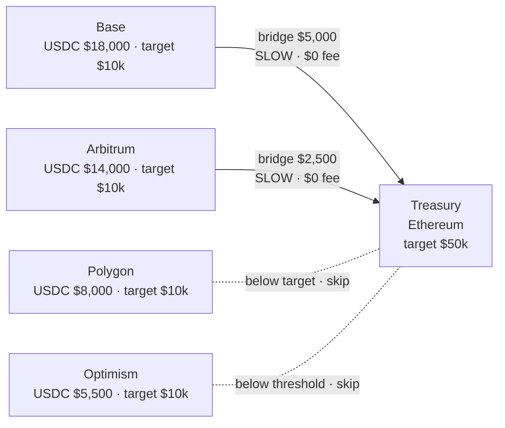

# Multi-Chain Treasury Management

## Business Case

Multi-chain treasury management is the process of monitoring USDC balances across multiple chains and automatically consolidating excess funds into a single master treasury. A treasury wallet might accumulate balances on Base, Arbitrum, Polygon, and Optimism through normal operations — fees collected, payments received, liquidity deployed. Rather than managing each chain manually, a treasury job runs on a schedule: it reads all balances in one call, converts any non-USDC tokens to USDC on each chain, then bridges excess funds to the main treasury using SLOW mode for zero protocol fees, while keeping every chain above a minimum operational balance.

### Who This Is For

- **Corporate treasuries** — consolidating on-chain stablecoin balances into a single reporting wallet
- **DAOs and multi-chain platforms** — sweeping accumulated fees and rewards to a master wallet on a schedule
- **DEX operators and DeFi protocols** — maintaining per-chain USDC ratios to support liquidity operations

### Key Features

- **Single-call balance snapshot** — fetch all token balances across all chains in one API call, no per-chain polling
- **Optional token normalization** — swap any non-USDC tokens to USDC on each chain before consolidating, keeping the treasury in a single asset
- **Threshold-based consolidation** — only moves funds when excess exceeds a configurable minimum, avoiding micro-transactions that cost more in gas than they move
- **Minimum balance protection** — every chain retains a configurable operational floor; no chain is ever fully drained
- **Zero-fee bridging with SLOW mode** — uses CCTP's slow path which carries no protocol fee, settling in ~20 minutes
- **Cron-ready job structure** — the consolidation function runs end-to-end and can be scheduled directly without additional orchestration

---

## Fund Flow Diagram



### Wallets in This Flow

This use case uses a single wallet, but it operates on multiple chains simultaneously.

- **Treasury Wallet (per-chain instances)** — one set of credentials (`TREASURY_WALLET_ID`) controls balances on Base, Arbitrum, Polygon, Optimism, and Ethereum. Each chain has its own balance, but you configure targets and minimums per chain. Funds on chains with excess balances bridge to the Ethereum instance, which is designated the main treasury. The wallet does not change — only which chain it is acting on changes per operation.

The distinction that matters here is between a **chain instance** (a balance on a specific chain) and the **wallet itself** (the single entity you authenticate as). App Kit handles routing to the correct chain based on the `chain` field you pass to `kit.bridge()` — you do not manage separate credentials per chain.

---

## Choosing Your Adapter

The SDK calls for swap, bridge, and send are identical regardless of adapter. The key differences are in how you manage keys and how you read balances.

| | Ethers (v6) | Circle Wallets |
|---|---|---|
| **Key management** | You hold and store private keys | Circle manages keys — no private key in your code |
| **Balance reading** | Direct ERC-20 contract reads via JSON-RPC | Circle API — no RPC node needed |
| **Best for** | Teams with existing EVM key infrastructure | Enterprises already using Circle Wallets or preferring managed key custody |

---

## Implementation: Ethers Adapter

Use this if your backend holds private keys directly, or if you use an existing EVM wallet infrastructure (Alchemy, Infura, etc.).

### Prerequisites

```bash
npm install @circle-fin/app-kit @circle-fin/adapter-ethers-v6 ethers dotenv
```

```bash
# .env
TREASURY_WALLET_KEY=0xYourTreasuryWalletPrivateKey
TREASURY_ADDRESS=0xYourTreasuryAddress
KIT_KEY=your_kit_key  # Required for swap operations
# Optional: bring your own RPC
ALCHEMY_KEY=your_alchemy_key
```

> The ethers adapter requires you to manage private keys. Store them in a secrets manager (AWS Secrets Manager, HashiCorp Vault, etc.) in production — never commit them to source control.

### Step 1: Setup

```typescript
import 'dotenv/config';
import { AppKit } from '@circle-fin/app-kit';
import { createEthersAdapterFromPrivateKey } from '@circle-fin/adapter-ethers-v6';
import { ethers } from 'ethers';

const CONSOLIDATION_THRESHOLD = 1000;
const SLIPPAGE_BPS = 50;
const USE_SLOW_MODE = true;

const kit = new AppKit();

const treasuryAdapter = createEthersAdapterFromPrivateKey({
  privateKey: process.env.TREASURY_WALLET_KEY as string
});

const TREASURY_ADDRESS = process.env.TREASURY_ADDRESS as string;
const TREASURY_CHAIN = 'Ethereum';
```

### Step 2: Check Balances

With ethers, balances are read directly from the ERC-20 contract on each chain via JSON-RPC.

```typescript
interface ChainBalance {
  chain: string;
  currentBalance: number;
  targetBalance: number;
  minimumBalance: number;
}

// Contract addresses needed for on-chain balance reads
const USDC_ADDRESSES: Record<string, string> = {
  Ethereum: '0xa0b86991c6218b36c1d19d4a2e9eb0ce3606eb48',
  Base:     '0x833589fCD6eDb6E08f4c7C32D4f71b54bdA02913',
  Arbitrum: '0xaf88d065e77c8cc2239327c5edb3a432268e5831',
  Polygon:  '0x3c499c542cEF5E3811e1192ce70d8cC03d5c3359',
  Optimism: '0x0b2C639c533813f4Aa9D7837CAf62653d097Ff85',
};

const ERC20_ABI = ['function balanceOf(address) view returns (uint256)'];

async function checkChainBalances(chains: ChainBalance[], swapToUsdc = false): Promise<void> {
  console.log('\n--- Chain Balances ---');

  for (const chain of chains) {
    const provider = new ethers.JsonRpcProvider(/* your RPC URL for this chain */);
    const contract = new ethers.Contract(USDC_ADDRESSES[chain.chain], ERC20_ABI, provider);
    const raw: bigint = await contract.balanceOf(TREASURY_ADDRESS);
    chain.currentBalance = parseFloat(ethers.formatUnits(raw, 6));

    const excess = chain.currentBalance - chain.targetBalance;
    const status =
      chain.currentBalance > chain.targetBalance ? 'EXCESS'
      : chain.currentBalance < chain.minimumBalance ? 'LOW'
      : 'OK';

    const delta = excess >= 0 ? `+$${excess.toFixed(0)}` : `-$${Math.abs(excess).toFixed(0)}`;
    console.log(`  ${chain.chain.padEnd(12)} $${chain.currentBalance.toLocaleString().padStart(8)}  (target $${chain.targetBalance.toLocaleString()}, ${delta})  [${status}]`);
  }

  if (swapToUsdc) {
    await swapNonUsdcToUsdc(chains);
  }
}

async function swapNonUsdcToUsdc(chains: ChainBalance[]): Promise<void> {
  // In practice: query each chain for non-USDC balances, then swap
  // Shown here as a placeholder — same kit.swap() call as Circle Wallet version
}
```

### Step 3: Plan Consolidation

This step is adapter-independent — pure logic, no SDK calls.

```typescript
function planConsolidation(chains: ChainBalance[]): { chain: string; amount: string }[] {
  console.log('\n--- Consolidation Plan ---');
  const operations: { chain: string; amount: string }[] = [];

  for (const chain of chains) {
    if (chain.chain === TREASURY_CHAIN) continue;

    const excess = chain.currentBalance - chain.targetBalance;
    const safeToMove = chain.currentBalance - chain.minimumBalance;
    const amountToMove = Math.min(excess, safeToMove);

    if (amountToMove > CONSOLIDATION_THRESHOLD) {
      console.log(`  ${chain.chain}: Consolidate $${amountToMove.toFixed(2)} → ${TREASURY_CHAIN}`);
      operations.push({ chain: chain.chain, amount: amountToMove.toFixed(2) });
    } else {
      console.log(`  ${chain.chain}: ${excess > 0 ? 'Below threshold' : 'At or below target'} — skip`);
    }
  }

  return operations;
}
```

### Step 4: Execute Consolidation

```typescript
async function executeConsolidation(
  operations: { chain: string; amount: string }[]
): Promise<void> {
  console.log('\n--- Executing Consolidation ---');

  for (const op of operations) {
    console.log(`\n  Bridging $${op.amount} from ${op.chain} → ${TREASURY_CHAIN}`);

    try {
      const result = await kit.bridge({
        from: { adapter: treasuryAdapter, chain: op.chain },
        to: {
          adapter: treasuryAdapter,
          chain: TREASURY_CHAIN,
          recipientAddress: TREASURY_ADDRESS
        },
        amount: op.amount,
        config: { transferSpeed: USE_SLOW_MODE ? 'SLOW' : 'FAST' }
      });

      console.log(`  ✓ Bridged $${op.amount} from ${op.chain}: ${result.steps[0].txHash}`);
    } catch (error: any) {
      console.error(`  ✗ Failed: ${error.message}`);
    }
  }
}
```

### Run

```bash
npx tsx app-kit-use-cases/02-treasury-management-ethers.ts
```

---

## Implementation: Circle Wallets Adapter

Use this if you manage wallets through Circle's developer-controlled wallet service. Circle handles key custody — you interact via API key and entity secret. Balance reads use the Circle API — no RPC node needed.

### Prerequisites

```bash
npm install @circle-fin/app-kit @circle-fin/adapter-circle-wallets @circle-fin/developer-controlled-wallets dotenv
```

```bash
# .env
CIRCLE_API_KEY=your_circle_api_key
CIRCLE_ENTITY_SECRET=your_entity_secret
TREASURY_WALLET_ID=your_treasury_wallet_id
TREASURY_ADDRESS=0xYourTreasuryAddress
KIT_KEY=your_kit_key  # Required for swap operations
```

> Get your Circle credentials at [console.circle.com](https://console.circle.com/). See the [Circle Wallet Quickstart](https://developers.circle.com/w3s/docs/programmable-wallets-quickstart) for wallet setup.

### Step 1: Setup

```typescript
import 'dotenv/config';
import { AppKit } from '@circle-fin/app-kit';
import { createCircleWalletsAdapter } from '@circle-fin/adapter-circle-wallets';

const CONSOLIDATION_THRESHOLD = 1000;
const SLIPPAGE_BPS = 50;
const USE_SLOW_MODE = true;

const kit = new AppKit();

// A single adapter instance handles all Circle wallets — address is specified per call
const circleAdapter = createCircleWalletsAdapter({
  apiKey: process.env.CIRCLE_API_KEY as string,
  entitySecret: process.env.CIRCLE_ENTITY_SECRET as string,
});

const TREASURY_ADDRESS = process.env.TREASURY_ADDRESS as string;
const TREASURY_WALLET_ID = process.env.TREASURY_WALLET_ID as string;
const TREASURY_CHAIN = 'Ethereum';
```

### Step 2: Check Balances + Swap to USDC (Optional)

With Circle Wallets, a single API call returns all token balances across all chains — no per-chain RPC reads.

**Output:**
```
--- Chain Balances ---
  Base         $15,000  (target $10,000, +$5,000)  [EXCESS]
  Arbitrum     $12,500  (target $10,000, +$2,500)  [EXCESS]
  Polygon       $8,000  (target $10,000, -$2,000)  [OK]
  Optimism      $5,500  (target $10,000, -$4,500)  [LOW]
  Ethereum     $25,000  (target $50,000, -$25,000) [OK]
```

```typescript
interface ChainBalance {
  chain: string;
  currentBalance: number;
  targetBalance: number;
  minimumBalance: number;
}

async function checkChainBalances(chains: ChainBalance[], swapToUsdc = false): Promise<void> {
  console.log('\n--- Chain Balances ---');

  const sdk = await circleAdapter.getSdk();

  // Single API call — returns all token balances across all chains
  const balanceResponse = await sdk.devc.getWalletTokenBalance({ id: TREASURY_WALLET_ID });
  const allBalances = balanceResponse.data?.tokenBalances ?? [];

  for (const chain of chains) {
    const chainBalances = allBalances.filter((b: any) => b.token?.blockchain === chain.chain);
    chain.currentBalance = chainBalances.reduce(
      (sum: number, b: any) => sum + parseFloat(b.amount ?? '0'), 0
    );

    const excess = chain.currentBalance - chain.targetBalance;
    const status =
      chain.currentBalance > chain.targetBalance ? 'EXCESS'
      : chain.currentBalance < chain.minimumBalance ? 'LOW'
      : 'OK';

    const delta = excess >= 0 ? `+$${excess.toFixed(0)}` : `-$${Math.abs(excess).toFixed(0)}`;
    console.log(`  ${chain.chain.padEnd(12)} $${chain.currentBalance.toLocaleString().padStart(8)}  (target $${chain.targetBalance.toLocaleString()}, ${delta})  [${status}]`);
  }

  if (swapToUsdc) {
    await swapNonUsdcToUsdc(allBalances);
  }
}

async function swapNonUsdcToUsdc(allBalances: any[]): Promise<void> {
  console.log('\n--- Swapping Tokens to USDC ---');

  const nonUsdc = allBalances.filter(
    (b: any) => b.token?.symbol?.toUpperCase() !== 'USDC' && parseFloat(b.amount ?? '0') > 0
  );

  if (nonUsdc.length === 0) {
    console.log('  No non-USDC tokens found');
    return;
  }

  for (const holding of nonUsdc) {
    const chain = holding.token?.blockchain;
    console.log(`\n  Swapping ${holding.amount} ${holding.token?.symbol} → USDC on ${chain}`);

    try {
      const result = await kit.swap({
        from: { adapter: circleAdapter, chain, address: TREASURY_ADDRESS },
        tokenIn: holding.token?.symbol,
        tokenOut: 'USDC',
        amountIn: holding.amount,
        config: { kitKey: process.env.KIT_KEY as string, slippageBps: SLIPPAGE_BPS }
      });

      console.log(`  ✓ Swapped: ${result.txHash}`);
    } catch (error: any) {
      console.error(`  ✗ Failed: ${error.message}`);
    }
  }
}
```

**When to enable `swapToUsdc`:**
- Your treasury wallets hold a mix of stablecoins (USDT, DAI, etc.)
- You want a single asset (USDC) flowing into the main treasury

### Step 3: Plan Consolidation

Identical logic to the ethers version — no adapter calls here.

```typescript
function planConsolidation(chains: ChainBalance[]): { chain: string; amount: string }[] {
  console.log('\n--- Consolidation Plan ---');
  const operations: { chain: string; amount: string }[] = [];

  for (const chain of chains) {
    if (chain.chain === TREASURY_CHAIN) continue;

    const excess = chain.currentBalance - chain.targetBalance;
    const safeToMove = chain.currentBalance - chain.minimumBalance;
    const amountToMove = Math.min(excess, safeToMove);

    if (amountToMove > CONSOLIDATION_THRESHOLD) {
      console.log(`  ${chain.chain}: Consolidate $${amountToMove.toFixed(2)} → ${TREASURY_CHAIN}`);
      operations.push({ chain: chain.chain, amount: amountToMove.toFixed(2) });
    } else {
      console.log(`  ${chain.chain}: ${excess > 0 ? 'Below threshold' : 'At or below target'} — skip`);
    }
  }

  return operations;
}
```

### Step 4: Execute Consolidation

The `address` field is required in `from` for Circle Wallets. The bridge call is otherwise identical to the ethers version.

```typescript
async function executeConsolidation(
  operations: { chain: string; amount: string }[]
): Promise<void> {
  console.log('\n--- Executing Consolidation ---');

  for (const op of operations) {
    console.log(`\n  Bridging $${op.amount} from ${op.chain} → ${TREASURY_CHAIN}`);

    try {
      const result = await kit.bridge({
        from: { adapter: circleAdapter, chain: op.chain as any, address: TREASURY_ADDRESS },
        to: {
          adapter: circleAdapter,
          chain: TREASURY_CHAIN as any,
          address: TREASURY_ADDRESS,
          recipientAddress: TREASURY_ADDRESS
        },
        amount: op.amount,
        config: { transferSpeed: USE_SLOW_MODE ? 'SLOW' : 'FAST' }
      });

      console.log(`  ✓ Bridged $${op.amount} from ${op.chain}: ${result.steps[0].txHash}`);
    } catch (error: any) {
      console.error(`  ✗ Failed: ${error.message}`);
    }
  }
}
```

### Run

```bash
npm run app-kit:treasury-management

# Or run directly
npx tsx app-kit-use-cases/02-treasury-management.ts
```

### Schedule as a Cron Job

```bash
# Run at 2 AM every night (low gas hours)
0 2 * * * cd /your/project && npm run app-kit:treasury-management >> /var/log/treasury.log 2>&1
```

---

## Adapter Differences at a Glance

| Step | Ethers | Circle Wallets |
|---|---|---|
| **Init adapter** | `createEthersAdapterFromPrivateKey({ privateKey })` | `createCircleWalletsAdapter({ apiKey, entitySecret })` |
| **Read balances** | ERC-20 `balanceOf` via JSON-RPC per chain | `sdk.devc.getWalletTokenBalance({ id })` — one call, all chains |
| **from context** | `{ adapter, chain }` | `{ adapter, chain, address }` — address required |
| **Swap / Bridge** | Identical | Identical |

---

## Key Takeaways

### 1. **Zero Bridge Fees with SLOW Mode**
- SLOW mode uses Circle's CCTP without charging a protocol fee
- Settlement takes ~15-30 minutes — perfectly fine for treasury operations
- Switch to FAST only when speed is critical (it costs ~$10 per bridge)

### 2. **Swap First, Then Bridge**
- Swap non-USDC tokens to USDC on each chain before bridging
- Keeps the main treasury in a single asset
- Swap is optional — skip if your wallets already hold only USDC

### 3. **Minimum Balance Protection**
- Every chain has a `minimumBalance` floor that is never breached
- The formula `min(excess, balance - minimum)` protects operational funds
- Prevents accidentally stranding a chain with no gas budget

### 4. **Threshold Filtering Reduces Noise**
- Only consolidate when excess exceeds `$1,000` (configurable)
- Eliminates micro-transactions that cost more in gas than they move

---

## Next Steps

1. **Database Integration**: Persist transaction hashes for accounting and audit trails
2. **Alerts**: Notify on Slack/email when a chain goes below `minimumBalance` or when a bridge fails
3. **Gas Timing**: Check gas prices before running and delay if unusually high

---

## Resources

- [Circle App Kit Documentation](https://developers.circle.com/app-kit)
- [Adapter Setups](https://developers.circle.com/app-kit/adapter-setups)
- [Circle Wallet Quickstart](https://developers.circle.com/w3s/docs/programmable-wallets-quickstart)
- [Circle CCTP Documentation](https://developers.circle.com/cctp)
- [Full Example Code](./02-treasury-management.ts)
