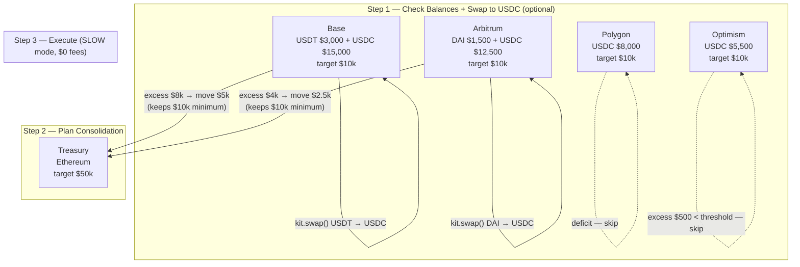

# Multi-Chain Treasury Management

## Business Case

Multi-chain treasury management is the process of monitoring USDC balances across multiple chains and automatically consolidating excess funds into a single master treasury. A treasury wallet might accumulate balances on Base, Arbitrum, Polygon, and Optimism through normal operations — fees collected, payments received, liquidity deployed. Rather than managing each chain manually, a treasury job runs on a schedule: it reads all balances in one call, converts any non-USDC tokens to USDC on each chain, then bridges excess funds to the main treasury using SLOW mode for zero protocol fees, while keeping every chain above a minimum operational balance.

### Who This Is For

- **Corporate treasuries** — consolidating on-chain stablecoin balances into a single reporting wallet
- **DAOs and multi-chain platforms** — sweeping accumulated fees and rewards to a master wallet on a schedule
- **DEX operators and DeFi protocols** — maintaining per-chain USDC ratios to support liquidity operations

### Key Features

- **Single-call balance snapshot** — fetch all token balances across all chains in one API call, no per-chain polling
- **Optional token normalization** — swap any non-USDC tokens to USDC on each chain before consolidating, keeping the treasury in a single asset
- **Threshold-based consolidation** — only moves funds when excess exceeds a configurable minimum, avoiding micro-transactions that cost more in gas than they move
- **Minimum balance protection** — every chain retains a configurable operational floor; no chain is ever fully drained
- **Zero-fee bridging with SLOW mode** — uses CCTP's slow path which carries no protocol fee, settling in ~20 minutes
- **Cron-ready job structure** — the consolidation function runs end-to-end and can be scheduled directly without additional orchestration

> **Note**: This example uses Circle Wallet for managed key custody. Replace `createCircleWalletAdapter` with your own wallet provider (Viem, Ethers, or custom) if needed — the treasury logic stays the same.

---

## Fund Flow Diagram



---

## Code Walkthrough

### Step 1: Setup & Configuration

**What this does:**
- Configures consolidation threshold to filter out micro-movements
- Sets SLOW mode to eliminate bridge protocol fees
- Initializes App Kit SDK and Circle Wallet adapter
- Reads treasury address and chain from environment

```typescript
import { StablecoinKit } from '@circle-fin/stablecoin-kit';
import { createCircleWalletAdapter } from '@circle-fin/adapter-circle-wallet';

const CONSOLIDATION_THRESHOLD = 1000; // Only move if excess > $1,000
const SLIPPAGE_BPS = 50;              // 0.5% slippage for swaps
const USE_SLOW_MODE = true;           // Free bridge — no protocol fees

const kit = new StablecoinKit();
const treasuryAdapter = createCircleWalletAdapter({
  apiKey: process.env.CIRCLE_API_KEY as string,
  walletId: process.env.TREASURY_WALLET_ID as string,
  entitySecret: process.env.CIRCLE_ENTITY_SECRET as string
});
```

---

### Step 2: Check Balances + Swap to USDC (Optional)

**What this does:**
- Makes a single API call to fetch all token balances across all chains
- Sums balances per chain and flags each as EXCESS, LOW, or OK
- Optionally calls `swapToUSDC` using the already-fetched balances — no second API call

**Output:**
```
--- Chain Balances ---
  Base         $15,000  (target $10,000, +$5,000)  [EXCESS]
  Arbitrum     $12,500  (target $10,000, +$2,500)  [EXCESS]
  Polygon       $8,000  (target $10,000, -$2,000)  [OK]
  Optimism      $5,500  (target $10,000, -$4,500)  [LOW]
  Ethereum     $25,000  (target $50,000, -$25,000) [OK]
```

```typescript
async function checkChainBalances(chains: ChainBalance[], swapToUsdc = false): Promise<void> {
  // Single call to fetch all token balances across all chains
  const allBalances = await treasuryAdapter.getWalletTokenBalances({
    walletId: process.env.TREASURY_WALLET_ID as string
  });

  for (const chain of chains) {
    const chainBalances = allBalances.filter(b => b.chain === chain.chain);
    chain.currentBalance = chainBalances.reduce(
      (sum, b) => sum + parseFloat(b.amount), 0
    );
    // ... log status
  }

  // Optional: swap any non-USDC tokens to USDC using the already-fetched balances
  if (swapToUsdc) {
    await swapToUSDC(allBalances);
  }
}

// Swap any non-USDC tokens to USDC (called from Step 1 when enabled)
async function swapToUSDC(allBalances: TokenBalance[]): Promise<void> {
  const nonUsdcTokens = allBalances.filter(
    b => b.token !== 'USDC' && parseFloat(b.amount) > 0
  );

  for (const holding of nonUsdcTokens) {
    const result = await kit.swap({
      from: { adapter: treasuryAdapter, chain: holding.chain },
      tokenIn: holding.token,
      tokenOut: 'USDC',
      amount: holding.amount,
      config: { kitKey: process.env.KIT_KEY as string, slippageBps: SLIPPAGE_BPS }
    });

    console.log(`  ✓ Swapped ${holding.amount} ${holding.token} → USDC on ${holding.chain}: ${result.txHash}`);
  }
}
```

**When to enable `swapToUsdc`:**
- Your treasury wallets hold a mix of stablecoins (USDT, DAI, etc.)
- You want a single asset (USDC) flowing into the main treasury

---

### Step 3: Plan Consolidation

**What this does:**
- Skips the main treasury chain
- Calculates how much can safely move without breaching minimum balance
- Applies the threshold filter — skips tiny excess amounts
- Returns a simple list of `{ chain, amount }` pairs (no bridges executed yet)

**Key protection:** `amountToMove = min(excess, balance - minimum)`
- Ensures the chain retains its operational floor
- Safe even when `targetBalance` is lower than `minimumBalance`

```typescript
function planConsolidation(chains: ChainBalance[]): { chain: string; amount: string }[] {
  const operations = [];

  for (const chain of chains) {
    if (chain.chain === TREASURY_CHAIN) continue;

    const excess = chain.currentBalance - chain.targetBalance;
    const safeToMove = chain.currentBalance - chain.minimumBalance;
    const amountToMove = Math.min(excess, safeToMove);

    if (amountToMove > CONSOLIDATION_THRESHOLD) {
      operations.push({ chain: chain.chain, amount: amountToMove.toFixed(2) });
    }
  }

  return operations;
}
```

---

### Step 4: Execute Consolidation

**What this does:**
- Iterates over planned operations and executes each bridge
- Uses SLOW mode — Circle's CCTP with no protocol fee
- Each bridge is independent — one failure doesn't stop the rest

**Note:**
- SLOW mode settles in ~15-30 minutes (vs seconds for FAST)
- Ideal for treasury consolidation — you trade speed for zero cost

```typescript
async function executeConsolidation(
  operations: { chain: string; amount: string }[]
): Promise<void> {
  for (const op of operations) {
    const result = await kit.bridge({
      from: { adapter: treasuryAdapter, chain: op.chain },
      to: {
        adapter: treasuryAdapter,
        chain: TREASURY_CHAIN,
        recipientAddress: TREASURY_ADDRESS
      },
      amount: op.amount,
      config: { transferSpeed: USE_SLOW_MODE ? 'SLOW' : 'FAST' }
    });

    console.log(`  ✓ Bridged $${op.amount} from ${op.chain}: ${result.steps[0].txHash}`);
  }
}
```

---

## Complete Example Script

### Prerequisites

```bash
# Install dependencies
npm install @circle-fin/stablecoin-kit @circle-fin/adapter-circle-wallet dotenv

# Create .env file
touch .env
```

### Environment Variables

> **Note**: This example uses Circle Wallet for managed key custody. To get your credentials:
> - API Key and Entity Secret: [Circle Console](https://console.circle.com/)
> - Setup guide: [Circle Wallet Quickstart](https://developers.circle.com/w3s/docs/programmable-wallets-quickstart)

```bash
# .env
CIRCLE_API_KEY=your_circle_api_key
TREASURY_WALLET_ID=your_treasury_wallet_id
CIRCLE_ENTITY_SECRET=your_entity_secret
TREASURY_ADDRESS=0xYourTreasuryAddress
KIT_KEY=your_kit_key  # Required for swap operations
```

### Full Code

```typescript
import 'dotenv/config';
import { StablecoinKit } from '@circle-fin/stablecoin-kit';
import { createCircleWalletAdapter } from '@circle-fin/adapter-circle-wallet';
// Note: createCircleWalletAdapter can be replaced with any wallet adapter
// (e.g., createViemAdapter, createEthersAdapter) depending on your wallet provider.

interface ChainBalance {
  chain: string;
  currentBalance: number;
  targetBalance: number;
  minimumBalance: number;
}

const CONSOLIDATION_THRESHOLD = 1000; // Only consolidate if excess > $1,000
const SLIPPAGE_BPS = 50;              // 0.5% slippage for swaps
const USE_SLOW_MODE = true;           // SLOW mode = free bridge (no protocol fees)

const kit = new StablecoinKit();
const treasuryAdapter = createCircleWalletAdapter({
  apiKey: process.env.CIRCLE_API_KEY as string,
  walletId: process.env.TREASURY_WALLET_ID as string,
  entitySecret: process.env.CIRCLE_ENTITY_SECRET as string
});

const TREASURY_ADDRESS = process.env.TREASURY_ADDRESS || '0xYourTreasuryAddress';
const TREASURY_CHAIN = 'Ethereum';

async function checkChainBalances(chains: ChainBalance[], swapToUsdc = false): Promise<void> {
  console.log('\n--- Chain Balances ---');

  // Single call to fetch all token balances across all chains
  const allBalances = await treasuryAdapter.getWalletTokenBalances({
    walletId: process.env.TREASURY_WALLET_ID as string
  });

  for (const chain of chains) {
    const chainBalances = allBalances.filter(b => b.chain === chain.chain);
    chain.currentBalance = chainBalances.reduce(
      (sum, b) => sum + parseFloat(b.amount), 0
    );

    const excess = chain.currentBalance - chain.targetBalance;
    const status =
      chain.currentBalance > chain.targetBalance ? 'EXCESS'
      : chain.currentBalance < chain.minimumBalance ? 'LOW'
      : 'OK';

    const delta = excess >= 0 ? `+$${excess.toFixed(0)}` : `-$${Math.abs(excess).toFixed(0)}`;
    console.log(`  ${chain.chain.padEnd(12)} $${chain.currentBalance.toLocaleString().padStart(8)}  (target $${chain.targetBalance.toLocaleString()}, ${delta})  [${status}]`);
  }

  // Optional: swap any non-USDC tokens to USDC using the already-fetched balances
  if (swapToUsdc) {
    await swapToUSDC(allBalances);
  }
}

// Swap any non-USDC tokens to USDC (called from Step 1 when enabled)
async function swapToUSDC(allBalances: { token: string; chain: string; amount: string }[]): Promise<void> {
  console.log('\n--- Swapping Tokens to USDC ---');

  const nonUsdcTokens = allBalances.filter(
    b => b.token !== 'USDC' && parseFloat(b.amount) > 0
  );

  if (nonUsdcTokens.length === 0) {
    console.log('  No non-USDC tokens found');
    return;
  }

  for (const holding of nonUsdcTokens) {
    console.log(`\n  Swapping ${holding.amount} ${holding.token} → USDC on ${holding.chain}`);

    try {
      const result = await kit.swap({
        from: { adapter: treasuryAdapter, chain: holding.chain },
        tokenIn: holding.token,
        tokenOut: 'USDC',
        amount: holding.amount,
        config: { kitKey: process.env.KIT_KEY as string, slippageBps: SLIPPAGE_BPS }
      });

      console.log(`  ✓ Swapped: ${result.txHash}`);
    } catch (error: any) {
      console.error(`  ✗ Failed: ${error.message}`);
    }
  }
}

function planConsolidation(chains: ChainBalance[]): { chain: string; amount: string }[] {
  console.log('\n--- Consolidation Plan ---');

  const operations: { chain: string; amount: string }[] = [];

  for (const chain of chains) {
    if (chain.chain === TREASURY_CHAIN) continue;

    const excess = chain.currentBalance - chain.targetBalance;
    // Never drain below minimum balance
    const safeToMove = chain.currentBalance - chain.minimumBalance;
    const amountToMove = Math.min(excess, safeToMove);

    if (amountToMove > CONSOLIDATION_THRESHOLD) {
      console.log(`  ${chain.chain}: Consolidate $${amountToMove.toFixed(2)} → ${TREASURY_CHAIN}`);
      operations.push({ chain: chain.chain, amount: amountToMove.toFixed(2) });
    }
  }

  return operations;
}

async function executeConsolidation(
  operations: { chain: string; amount: string }[]
): Promise<void> {
  console.log('\n--- Executing Consolidation ---');

  for (const op of operations) {
    try {
      const result = await kit.bridge({
        from: { adapter: treasuryAdapter, chain: op.chain },
        to: {
          adapter: treasuryAdapter,
          chain: TREASURY_CHAIN,
          recipientAddress: TREASURY_ADDRESS
        },
        amount: op.amount,
        config: { transferSpeed: USE_SLOW_MODE ? 'SLOW' : 'FAST' }
      });

      console.log(`  ✓ Bridged $${op.amount} from ${op.chain}: ${result.steps[0].txHash}`);
    } catch (error: any) {
      console.error(`  ✗ Failed: ${error.message}`);
    }
  }
}

const chainBalances: ChainBalance[] = [
  { chain: 'Base',     currentBalance: 0, targetBalance: 10000, minimumBalance: 5000 },
  { chain: 'Arbitrum', currentBalance: 0, targetBalance: 10000, minimumBalance: 5000 },
  { chain: 'Polygon',  currentBalance: 0, targetBalance: 10000, minimumBalance: 5000 },
  { chain: 'Optimism', currentBalance: 0, targetBalance: 10000, minimumBalance: 5000 },
  { chain: 'Ethereum', currentBalance: 0, targetBalance: 50000, minimumBalance: 20000 }
];

// Step 1: Fetch live balances; pass true to also swap non-USDC tokens to USDC
await checkChainBalances(chainBalances, /* swapToUsdc */ true);

// Step 2: Decide what to move
const operations = planConsolidation(chainBalances);

if (operations.length > 0) {
  // Step 3: Execute bridges
  await executeConsolidation(operations);
}
```

### Run the Example

```bash
# Run with tsx
npm run app-kit:treasury-management

# Or run directly
npx tsx app-kit-use-cases/02-treasury-management.ts
```

### Schedule as a Daily Cron Job

```bash
# Run at 2 AM every night (low gas hours)
0 2 * * * cd /your/project && npm run app-kit:treasury-management >> /var/log/treasury.log 2>&1
```

---

## Key Takeaways

### 1. **Zero Bridge Fees with SLOW Mode**
- SLOW mode uses Circle's CCTP without charging a protocol fee
- Settlement takes ~15-30 minutes — perfectly fine for treasury operations
- Switch to FAST only when speed is critical (it costs ~$10 per bridge)

### 2. **Swap First, Then Bridge**
- Swap non-USDC tokens to USDC on each chain before bridging
- Keeps the main treasury in a single asset
- Swap is optional — skip if your wallets already hold only USDC

### 3. **Minimum Balance Protection**
- Every chain has a `minimumBalance` floor that is never breached
- The formula `min(excess, balance - minimum)` protects operational funds
- Prevents accidentally stranding a chain with no gas budget

### 4. **Threshold Filtering Reduces Noise**
- Only consolidate when excess exceeds `$1,000` (configurable)
- Eliminates micro-transactions that cost more in gas than they move

---

## Next Steps

1. **Fetch Live Balances**: Replace mock `currentBalance` with live on-chain reads using viem's `readContract` on the USDC token contract
2. **Database Integration**: Persist transaction hashes for accounting and audit trails
3. **Alerts**: Notify on Slack/email when a chain goes below `minimumBalance` or when a bridge fails
4. **Gas Timing**: Check gas prices before running and delay if unusually high

---

## Resources

- [Circle App Kit Documentation](https://developers.circle.com/app-kit)
- [Circle CCTP Documentation](https://developers.circle.com/cctp)
- [Full Example Code](./02-treasury-management.ts)

---

**Questions?** See the integration checklist in the [code comments](./02-treasury-management.ts) or reach out to Circle support.
