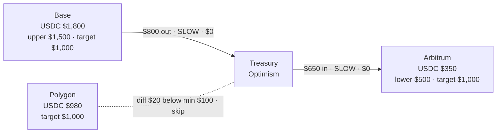

# Multi-Chain Treasury Management

## Business Case

Multi-chain treasury management is the process of keeping USDC balances on operational chains within a defined range, using a central treasury as a reserve. Each chain has an upper bound, a target, and a lower bound. A treasury job runs on a schedule: it reads all balances, then bridges funds in either direction — flushing excess out to the treasury when a chain is over-funded, and drawing funds in from the treasury when a chain runs low. A minimum bridge amount prevents micro-transactions from triggering unnecessary gas spend.

### Who This Is For

- **Corporate treasuries** — automatically keeping each chain's operational balance within a defined band, with a central reserve handling both top-ups and sweeps
- **DAOs and multi-chain platforms** — preventing any chain from running dry or accumulating idle capital without manual intervention
- **DEX operators and DeFi protocols** — maintaining per-chain USDC ratios to support liquidity operations

### Key Features

- **Single-call balance snapshot** — fetch all token balances across all chains in one API call, no per-chain polling
- **Bidirectional rebalancing** — bridges excess out to the treasury when a chain exceeds its upper bound, and draws funds in from the treasury when a chain falls below its lower bound
- **Optional token normalization** — swap any non-USDC tokens to USDC on each chain before rebalancing, keeping the treasury in a single asset
- **Minimum bridge amount** — skips rebalancing when the difference is below a configurable floor, avoiding micro-transactions that cost more in gas than they move
- **Zero-fee bridging with SLOW mode** — uses CCTP's slow path which carries no protocol fee, settling in ~15-30 minutes
- **Cron-ready job structure** — the rebalancing function runs end-to-end and can be scheduled directly without additional orchestration

---

## Fund Flow Diagram



Each operational chain has an **upper bound** ($1,500), a **target** ($1,000), and a **lower bound** ($500). When a chain's balance exceeds the upper bound, the excess is bridged out to the Optimism treasury. When it falls below the lower bound, the deficit is drawn in from the treasury. Rebalancing is skipped when the difference is less than the minimum bridge amount ($100) — Polygon's $20 imbalance in this example is below that floor.

### Wallets in This Flow

This use case uses a single wallet, but it operates on multiple chains simultaneously.

- **Treasury Wallet (per-chain instances)** — one set of credentials (`TREASURY_WALLET_ID`) controls balances on Base, Arbitrum, and Polygon. Each chain has its own balance with an upper bound, target, and lower bound. The Optimism instance is the central reserve: over-funded chains bridge excess to it, and under-funded chains draw from it. The wallet does not change — only which chain it is acting on changes per operation.

The distinction that matters here is between a **chain instance** (a balance on a specific chain) and the **wallet itself** (the single entity you authenticate as). App Kit handles routing to the correct chain based on the `chain` field you pass to `kit.bridge()` — you do not manage separate credentials per chain.

---

## Choosing Your Adapter

The SDK calls for swap, bridge, and send are identical regardless of adapter. The key differences are in how you manage keys and how you read balances.

| | Ethers (v6) | Circle Wallets |
|---|---|---|
| **Key management** | You hold and store private keys | Circle manages keys — no private key in your code |
| **Balance reading** | Direct ERC-20 contract reads via JSON-RPC | Circle API — no RPC node needed |
| **Best for** | Teams with existing EVM key infrastructure | Enterprises already using Circle Wallets or preferring managed key custody |

---

## Implementation: Ethers Adapter

Use this if your backend holds private keys directly, or if you use an existing EVM wallet infrastructure (Alchemy, Infura, etc.).

### Prerequisites

```bash
npm install @circle-fin/app-kit @circle-fin/adapter-ethers-v6 ethers dotenv
```

```bash
# .env
TREASURY_WALLET_KEY=0xYourTreasuryWalletPrivateKey
TREASURY_ADDRESS=0xYourTreasuryAddress
KIT_KEY=your_kit_key  # Required for swap operations
# Optional: bring your own RPC
ALCHEMY_KEY=your_alchemy_key
```

> The ethers adapter requires you to manage private keys. Store them in a secrets manager (AWS Secrets Manager, HashiCorp Vault, etc.) in production — never commit them to source control.

### Step 1: Setup

```typescript
import 'dotenv/config';
import { AppKit } from '@circle-fin/app-kit';
import { createEthersAdapterFromPrivateKey } from '@circle-fin/adapter-ethers-v6';
import { ethers } from 'ethers';

const MIN_BRIDGE_AMOUNT = 100; // Skip rebalancing when difference is below this amount
const SLIPPAGE_BPS = 50;       // Max swap slippage (50 = 0.5%)
const USE_SLOW_MODE = true;    // SLOW = free CCTP bridge, settles in ~15-30 min

const kit = new AppKit();

// Signs transactions with your private key — load from a secrets manager in production
const treasuryAdapter = createEthersAdapterFromPrivateKey({
  privateKey: process.env.TREASURY_WALLET_KEY as string
});

const TREASURY_ADDRESS = process.env.TREASURY_ADDRESS as string;
const TREASURY_CHAIN = 'Optimism'; // Central reserve — absorbs excess and funds top-ups
```

### Step 2: Check Balances + Swap to USDC (Optional)

With ethers, balances are read directly from the ERC-20 contract on each chain via JSON-RPC.

**Output:**
```
--- Chain Balances ---
  Base         $1,800  (target $1,000, upper $1,500)  [OVER]
  Arbitrum       $350  (target $1,000, lower   $500)  [UNDER]
  Polygon        $980  (target $1,000)                [OK]
```

```typescript
interface ChainBalance {
  chain: string;
  currentBalance: number;
  upperBound: number;    // Bridge excess out when balance exceeds this
  targetBalance: number; // Restore to this level when rebalancing in either direction
  lowerBound: number;    // Draw funds in when balance falls below this
}

// Required for on-chain balance reads — App Kit uses token aliases for kit.swap/bridge/send
// but direct ERC-20 reads need the actual contract address
const USDC_ADDRESSES: Record<string, string> = {
  Base:     '0x833589fCD6eDb6E08f4c7C32D4f71b54bdA02913',
  Arbitrum: '0xaf88d065e77c8cc2239327c5edb3a432268e5831',
  Polygon:  '0x3c499c542cEF5E3811e1192ce70d8cC03d5c3359',
};

const ERC20_ABI = ['function balanceOf(address) view returns (uint256)'];

// Non-USDC token addresses for swap reads — extend as needed
const NON_USDC_ADDRESSES: Record<string, { symbol: string; address: string }[]> = {
  Base:     [{ symbol: 'USDT', address: '0xfde4C96c8593536E31F229EA8f37b2ADa2699bb2' }],
  Arbitrum: [{ symbol: 'USDT', address: '0xfd086bc7cd5c481dcc9c85ebe478a1c0b69fcbb9' }],
  Polygon:  [{ symbol: 'USDT', address: '0xc2132d05d31c914a87c6611c10748aeb04b58e8f' }],
};

async function checkChainBalances(chains: ChainBalance[], swapToUsdc = false): Promise<void> {
  console.log('\n--- Chain Balances ---');

  for (const chain of chains) {
    const provider = new ethers.JsonRpcProvider(/* your RPC URL for this chain */);
    const contract = new ethers.Contract(USDC_ADDRESSES[chain.chain], ERC20_ABI, provider);
    const raw: bigint = await contract.balanceOf(TREASURY_ADDRESS);
    chain.currentBalance = parseFloat(ethers.formatUnits(raw, 6)); // USDC has 6 decimals

    const status =
      chain.currentBalance > chain.upperBound ? 'OVER'
      : chain.currentBalance < chain.lowerBound ? 'UNDER'
      : 'OK';

    const hint = status === 'OVER'
      ? `, upper $${chain.upperBound.toLocaleString()}`
      : status === 'UNDER'
      ? `, lower $${chain.lowerBound.toLocaleString()}`
      : '';
    console.log(`  ${chain.chain.padEnd(12)} $${chain.currentBalance.toLocaleString().padStart(6)}  (target $${chain.targetBalance.toLocaleString()}${hint})  [${status}]`);
  }

  if (swapToUsdc) { // Enable when treasury holds non-USDC tokens
    await swapNonUsdcToUsdc(chains);
  }
}

async function swapNonUsdcToUsdc(chains: ChainBalance[]): Promise<void> {
  console.log('\n--- Swapping Tokens to USDC ---');

  for (const chain of chains) {
    const tokens = NON_USDC_ADDRESSES[chain.chain] ?? [];
    const provider = new ethers.JsonRpcProvider(/* your RPC URL for this chain */);

    for (const token of tokens) {
      const contract = new ethers.Contract(token.address, ERC20_ABI, provider);
      const raw: bigint = await contract.balanceOf(TREASURY_ADDRESS);
      const amount = parseFloat(ethers.formatUnits(raw, 6));

      if (amount === 0) continue;

      console.log(`\n  Swapping ${amount} ${token.symbol} → USDC on ${chain.chain}`);

      try {
        const result = await kit.swap({
          from: { adapter: treasuryAdapter, chain: chain.chain },
          tokenIn: token.symbol,
          tokenOut: 'USDC',
          amountIn: amount.toFixed(6),
          // kitKey is required for swaps — separate from your ethers private key
          config: { kitKey: process.env.KIT_KEY as string, slippageBps: SLIPPAGE_BPS }
        });

        console.log(`  ✓ Swapped: ${result.txHash}`);
      } catch (error: any) {
        console.error(`  ✗ Failed: ${error.message}`);
      }
    }
  }
}
```

**When to enable `swapToUsdc`:**
- Your treasury wallets hold a mix of stablecoins (USDT, DAI, etc.)
- You want a single asset (USDC) flowing into the main treasury

### Step 3: Plan Rebalancing

This step is adapter-independent — pure logic, no SDK calls.

```typescript
type Direction = 'OUT' | 'IN'; // OUT = bridge to treasury, IN = draw from treasury

interface RebalanceOp {
  chain: string;
  direction: Direction;
  amount: string;
}

function planRebalancing(chains: ChainBalance[]): RebalanceOp[] {
  console.log('\n--- Rebalancing Plan ---');
  const operations: RebalanceOp[] = [];

  for (const chain of chains) {
    if (chain.chain === TREASURY_CHAIN) continue; // Treasury chain — skip

    if (chain.currentBalance > chain.upperBound) {
      // Over upper bound — bridge excess back to target
      const amount = chain.currentBalance - chain.targetBalance;
      if (amount >= MIN_BRIDGE_AMOUNT) {
        console.log(`  ${chain.chain}: OVER — bridge $${amount.toFixed(2)} out to ${TREASURY_CHAIN}`);
        operations.push({ chain: chain.chain, direction: 'OUT', amount: amount.toFixed(2) });
      } else {
        console.log(`  ${chain.chain}: OVER but diff $${amount.toFixed(2)} < min $${MIN_BRIDGE_AMOUNT} — skip`);
      }
    } else if (chain.currentBalance < chain.lowerBound) {
      // Below lower bound — draw from treasury to restore target
      const amount = chain.targetBalance - chain.currentBalance;
      if (amount >= MIN_BRIDGE_AMOUNT) {
        console.log(`  ${chain.chain}: UNDER — draw $${amount.toFixed(2)} in from ${TREASURY_CHAIN}`);
        operations.push({ chain: chain.chain, direction: 'IN', amount: amount.toFixed(2) });
      } else {
        console.log(`  ${chain.chain}: UNDER but diff $${amount.toFixed(2)} < min $${MIN_BRIDGE_AMOUNT} — skip`);
      }
    } else {
      const diff = Math.abs(chain.currentBalance - chain.targetBalance);
      console.log(`  ${chain.chain}: OK — diff $${diff.toFixed(2)} within bounds — skip`);
    }
  }

  return operations;
}
```

### Step 4: Execute Rebalancing

Bridge each planned operation using SLOW mode for zero protocol fees.

```typescript
async function executeRebalancing(operations: RebalanceOp[]): Promise<void> {
  console.log('\n--- Executing Rebalancing ---');

  for (const op of operations) {
    const label = op.direction === 'OUT'
      ? `${op.chain} → ${TREASURY_CHAIN}`
      : `${TREASURY_CHAIN} → ${op.chain}`;
    console.log(`\n  Bridging $${op.amount}: ${label}`);

    try {
      const result = await kit.bridge({
        from: {
          adapter: treasuryAdapter,
          chain: op.direction === 'OUT' ? op.chain : TREASURY_CHAIN
        },
        to: {
          adapter: treasuryAdapter,
          chain: op.direction === 'OUT' ? TREASURY_CHAIN : op.chain,
          // Ensures USDC is minted to the treasury address, not the adapter's default
          recipientAddress: TREASURY_ADDRESS
        },
        amount: op.amount,
        config: { transferSpeed: USE_SLOW_MODE ? 'SLOW' : 'FAST' } // SLOW = free, FAST = ~$10
      });

      console.log(`  ✓ Bridged: ${result.steps[0].txHash}`);
    } catch (error: any) {
      // Catch per-operation so one failure doesn't abort the rest
      console.error(`  ✗ Failed: ${error.message}`);
    }
  }
}
```

### Run

```bash
npx tsx app-kit-use-cases/02-treasury-management-ethers.ts
```

---

## Implementation: Circle Wallets Adapter

Use this if you manage wallets through Circle's developer-controlled wallet service. Circle handles key custody — you interact via API key and entity secret. Balance reads use the Circle API — no RPC node needed.

### Prerequisites

```bash
npm install @circle-fin/app-kit @circle-fin/adapter-circle-wallets @circle-fin/developer-controlled-wallets dotenv
```

```bash
# .env
CIRCLE_API_KEY=your_circle_api_key
CIRCLE_ENTITY_SECRET=your_entity_secret
TREASURY_WALLET_ID=your_treasury_wallet_id
TREASURY_ADDRESS=0xYourTreasuryAddress
KIT_KEY=your_kit_key  # Required for swap operations
```

> Get your Circle credentials at [console.circle.com](https://console.circle.com/). See the [Circle Wallet Quickstart](https://developers.circle.com/w3s/docs/programmable-wallets-quickstart) for wallet setup.

### Step 1: Setup

```typescript
import 'dotenv/config';
import { AppKit } from '@circle-fin/app-kit';
import { createCircleWalletsAdapter } from '@circle-fin/adapter-circle-wallets';

const MIN_BRIDGE_AMOUNT = 100; // Skip rebalancing when difference is below this amount
const SLIPPAGE_BPS = 50;       // Max swap slippage (50 = 0.5%)
const USE_SLOW_MODE = true;    // SLOW = free CCTP bridge, settles in ~15-30 min

const kit = new AppKit();

// One adapter instance covers all Circle wallets — wallet is identified by address per call
const circleAdapter = createCircleWalletsAdapter({
  apiKey: process.env.CIRCLE_API_KEY as string,
  entitySecret: process.env.CIRCLE_ENTITY_SECRET as string,
});

const TREASURY_ADDRESS = process.env.TREASURY_ADDRESS as string;
const TREASURY_WALLET_ID = process.env.TREASURY_WALLET_ID as string;
const TREASURY_CHAIN = 'Optimism'; // Central reserve — absorbs excess and funds top-ups
```

### Step 2: Check Balances + Swap to USDC (Optional)

With Circle Wallets, a single API call returns all token balances across all chains — no per-chain RPC reads.

**Output:**
```
--- Chain Balances ---
  Base         $1,800  (target $1,000, upper $1,500)  [OVER]
  Arbitrum       $350  (target $1,000, lower   $500)  [UNDER]
  Polygon        $980  (target $1,000)                [OK]
```

```typescript
interface ChainBalance {
  chain: string;
  currentBalance: number;
  upperBound: number;    // Bridge excess out when balance exceeds this
  targetBalance: number; // Restore to this level when rebalancing in either direction
  lowerBound: number;    // Draw funds in when balance falls below this
}

async function checkChainBalances(chains: ChainBalance[], swapToUsdc = false): Promise<void> {
  console.log('\n--- Chain Balances ---');

  const sdk = await circleAdapter.getSdk();

  // Single API call — returns all token balances across all chains at once
  const balanceResponse = await sdk.devc.getWalletTokenBalance({ id: TREASURY_WALLET_ID });
  const allBalances = balanceResponse.data?.tokenBalances ?? [];

  for (const chain of chains) {
    const chainBalances = allBalances.filter((b: any) => b.token?.blockchain === chain.chain);
    chain.currentBalance = chainBalances.reduce(
      (sum: number, b: any) => sum + parseFloat(b.amount ?? '0'), 0
    );

    const status =
      chain.currentBalance > chain.upperBound ? 'OVER'
      : chain.currentBalance < chain.lowerBound ? 'UNDER'
      : 'OK';

    const hint = status === 'OVER'
      ? `, upper $${chain.upperBound.toLocaleString()}`
      : status === 'UNDER'
      ? `, lower $${chain.lowerBound.toLocaleString()}`
      : '';
    console.log(`  ${chain.chain.padEnd(12)} $${chain.currentBalance.toLocaleString().padStart(6)}  (target $${chain.targetBalance.toLocaleString()}${hint})  [${status}]`);
  }

  if (swapToUsdc) { // Enable when treasury holds non-USDC tokens
    await swapNonUsdcToUsdc(allBalances);
  }
}

async function swapNonUsdcToUsdc(allBalances: any[]): Promise<void> {
  console.log('\n--- Swapping Tokens to USDC ---');

  const nonUsdc = allBalances.filter(
    (b: any) => b.token?.symbol?.toUpperCase() !== 'USDC' && parseFloat(b.amount ?? '0') > 0
  );

  if (nonUsdc.length === 0) {
    console.log('  No non-USDC tokens found');
    return;
  }

  for (const holding of nonUsdc) {
    const chain = holding.token?.blockchain;
    console.log(`\n  Swapping ${holding.amount} ${holding.token?.symbol} → USDC on ${chain}`);

    try {
      const result = await kit.swap({
        from: { adapter: circleAdapter, chain, address: TREASURY_ADDRESS }, // address required for Circle Wallets
        tokenIn: holding.token?.symbol,
        tokenOut: 'USDC',
        amountIn: holding.amount,
        config: { kitKey: process.env.KIT_KEY as string, slippageBps: SLIPPAGE_BPS }
      });

      console.log(`  ✓ Swapped: ${result.txHash}`);
    } catch (error: any) {
      console.error(`  ✗ Failed: ${error.message}`);
    }
  }
}
```

**When to enable `swapToUsdc`:**
- Your treasury wallets hold a mix of stablecoins (USDT, DAI, etc.)
- You want a single asset (USDC) flowing into the main treasury

### Step 3: Plan Rebalancing

This step is adapter-independent — pure logic, no SDK calls.

```typescript
type Direction = 'OUT' | 'IN'; // OUT = bridge to treasury, IN = draw from treasury

interface RebalanceOp {
  chain: string;
  direction: Direction;
  amount: string;
}

function planRebalancing(chains: ChainBalance[]): RebalanceOp[] {
  console.log('\n--- Rebalancing Plan ---');
  const operations: RebalanceOp[] = [];

  for (const chain of chains) {
    if (chain.chain === TREASURY_CHAIN) continue; // Treasury chain — skip

    if (chain.currentBalance > chain.upperBound) {
      // Over upper bound — bridge excess back to target
      const amount = chain.currentBalance - chain.targetBalance;
      if (amount >= MIN_BRIDGE_AMOUNT) {
        console.log(`  ${chain.chain}: OVER — bridge $${amount.toFixed(2)} out to ${TREASURY_CHAIN}`);
        operations.push({ chain: chain.chain, direction: 'OUT', amount: amount.toFixed(2) });
      } else {
        console.log(`  ${chain.chain}: OVER but diff $${amount.toFixed(2)} < min $${MIN_BRIDGE_AMOUNT} — skip`);
      }
    } else if (chain.currentBalance < chain.lowerBound) {
      // Below lower bound — draw from treasury to restore target
      const amount = chain.targetBalance - chain.currentBalance;
      if (amount >= MIN_BRIDGE_AMOUNT) {
        console.log(`  ${chain.chain}: UNDER — draw $${amount.toFixed(2)} in from ${TREASURY_CHAIN}`);
        operations.push({ chain: chain.chain, direction: 'IN', amount: amount.toFixed(2) });
      } else {
        console.log(`  ${chain.chain}: UNDER but diff $${amount.toFixed(2)} < min $${MIN_BRIDGE_AMOUNT} — skip`);
      }
    } else {
      const diff = Math.abs(chain.currentBalance - chain.targetBalance);
      console.log(`  ${chain.chain}: OK — diff $${diff.toFixed(2)} within bounds — skip`);
    }
  }

  return operations;
}
```

### Step 4: Execute Rebalancing

Bridge each planned operation using SLOW mode for zero protocol fees. The `address` field is required in `from` for Circle Wallets.

```typescript
async function executeRebalancing(operations: RebalanceOp[]): Promise<void> {
  console.log('\n--- Executing Rebalancing ---');

  for (const op of operations) {
    const fromChain = op.direction === 'OUT' ? op.chain : TREASURY_CHAIN;
    const toChain   = op.direction === 'OUT' ? TREASURY_CHAIN : op.chain;
    const label = `${fromChain} → ${toChain}`;
    console.log(`\n  Bridging $${op.amount}: ${label}`);

    try {
      const result = await kit.bridge({
        from: { adapter: circleAdapter, chain: fromChain as any, address: TREASURY_ADDRESS }, // address required for Circle Wallets
        to: {
          adapter: circleAdapter,
          chain: toChain as any,
          address: TREASURY_ADDRESS,
          // Ensures USDC is minted to the treasury address, not the adapter's default
          recipientAddress: TREASURY_ADDRESS
        },
        amount: op.amount,
        config: { transferSpeed: USE_SLOW_MODE ? 'SLOW' : 'FAST' } // SLOW = free, FAST = ~$10
      });

      console.log(`  ✓ Bridged: ${result.steps[0].txHash}`);
    } catch (error: any) {
      // Catch per-operation so one failure doesn't abort the rest
      console.error(`  ✗ Failed: ${error.message}`);
    }
  }
}
```

### Run

```bash
npm run app-kit:treasury-management

# Or run directly
npx tsx app-kit-use-cases/02-treasury-management.ts
```

### Schedule as a Cron Job

```bash
# Run at 2 AM every night (low gas hours)
0 2 * * * cd /your/project && npm run app-kit:treasury-management >> /var/log/treasury.log 2>&1
```

---

## Adapter Differences at a Glance

| Step | Ethers | Circle Wallets |
|---|---|---|
| **Init adapter** | `createEthersAdapterFromPrivateKey({ privateKey })` | `createCircleWalletsAdapter({ apiKey, entitySecret })` |
| **Read balances** | ERC-20 `balanceOf` via JSON-RPC per chain | `sdk.devc.getWalletTokenBalance({ id })` — one call, all chains |
| **from context** | `{ adapter, chain }` | `{ adapter, chain, address }` — address required |
| **Swap / Bridge** | Identical | Identical |

---

## Key Takeaways

### 1. **Bidirectional Rebalancing Keeps Every Chain Operational**
- Chains above the upper bound flush excess to the treasury; chains below the lower bound draw from it
- A single job handles both directions — no separate sweep and top-up processes needed
- The treasury on Optimism acts as the reserve, absorbing and distributing funds automatically

### 2. **Minimum Bridge Amount Prevents Noise**
- Rebalancing only triggers when the difference meets the `MIN_BRIDGE_AMOUNT` floor
- Eliminates micro-transactions that cost more in gas than they move
- Tune this value based on your expected gas costs per chain

### 3. **Zero Bridge Fees with SLOW Mode**
- SLOW mode uses Circle's CCTP without charging a protocol fee
- Settlement takes ~15-30 minutes — perfectly fine for treasury operations
- Switch to FAST only when speed is critical (it costs ~$10 per bridge)

### 4. **Swap First, Then Rebalance**
- Swap non-USDC tokens to USDC on each chain before rebalancing
- Keeps the central treasury in a single asset
- Swap is optional — skip if your wallets already hold only USDC

---

## Next Steps

1. **Database Integration**: Persist transaction hashes for accounting and audit trails
2. **Alerts**: Notify on Slack/email when a chain crosses its upper or lower bound, or when a bridge fails
3. **Gas Timing**: Check gas prices before running and delay if unusually high

---

## Resources

- [Circle App Kit Documentation](https://developers.circle.com/app-kit)
- [Adapter Setups](https://developers.circle.com/app-kit/adapter-setups)
- [Circle Wallet Quickstart](https://developers.circle.com/w3s/docs/programmable-wallets-quickstart)
- [Circle CCTP Documentation](https://developers.circle.com/cctp)
- [Full Example Code](./02-treasury-management.ts)
