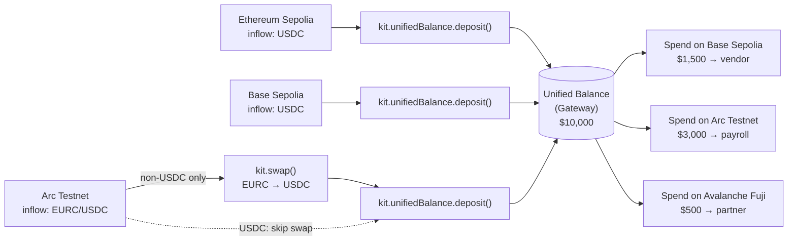

# Multi-Chain Treasury Management

## Business Case

A multi-chain treasury receives funds on whichever chain a customer or counterparty happens to send from, and needs to deploy those funds on whichever chain the next outflow lives on. The hard part has never been the receive or the send — it is everything between them: tracking what sits on which chain, deciding when to rebalance, swapping non-USDC inflows to USDC, and bridging between chains so the operational wallet always has enough to spend.

App Kit's **Unified Balance** collapses that middle layer. Every USDC deposit, from any chain, lands in a single cross-chain balance backed by Circle's Gateway protocol. When you need to pay out, you spend from that balance on the destination chain and the funds are minted there instantly — no bridge step, no per-chain liquidity to pre-position, no idle capital sitting on the wrong chain.

The result: your only operational work is an EOA wallet on each chain you receive on, a one-time swap to USDC for any non-USDC inflows, and a deposit. After that, the destination chain of an outflow is just a parameter on the spend call.

### Who This Is For

- **Corporate treasuries** — receiving customer/partner payments across many chains and paying out vendors, payroll, or settlements wherever they sit
- **DAOs and multi-chain platforms** — eliminating idle per-chain reserves and the rebalancing job that maintains them
- **Cross-chain payment platforms** — accepting inflows on any chain and paying out instantly on any other, without bridging in the hot path

### Key Features

- **One USDC balance across all chains** — `kit.unifiedBalance.getBalances()` returns a single aggregated total plus per-chain breakdown; no manual ledger to maintain
- **Instant cross-chain spend** — `kit.unifiedBalance.spend()` mints USDC on the destination chain in a single call, no bridge wait, no FAST/SLOW tradeoff
- **No rebalancing job** — Gateway is the rebalancer; you stop running upper/lower bound checks, scheduled sweeps, or cron-triggered top-ups
- **Receive on EOA, deposit on EOA** — no smart contract wallet required; the same private key signs deposits and spends across every supported chain
- **Optional swap-first normalization** — `kit.swap()` converts USDT/DAI/PYUSD/etc. inflows to USDC before deposit, so a single asset funds the unified balance
- **Fee estimation up front** — `kit.unifiedBalance.estimateSpend()` returns fees before the spend so you can preview cost per payout

---

## Fund Flow Diagram


```mermaid
flowchart LR
    IN_ETH["Ethereum Sepolia<br/>inflow: USDC"]
    IN_BASE["Base Sepolia<br/>inflow: USDC"]
    IN_ARC["Arc Testnet<br/>inflow: EURC/USDC"]

    SWAP["kit.swap()<br/>EURC → USDC"]

    DEP_ETH["kit.unifiedBalance.deposit()"]
    DEP_BASE["kit.unifiedBalance.deposit()"]
    DEP_ARC["kit.unifiedBalance.deposit()"]

    UB[("Unified Balance<br/>(Gateway)<br/>$10,000")]

    OUT_BASE["Spend on Base Sepolia<br/>$1,500 → vendor"]
    OUT_ARC["Spend on Arc Testnet<br/>$3,000 → payroll"]
    OUT_AVAX["Spend on Avalanche Fuji<br/>$500 → partner"]

    IN_ETH --> DEP_ETH
    IN_BASE --> DEP_BASE
    IN_ARC -->|"non-USDC only"| SWAP
    SWAP --> DEP_ARC
    IN_ARC -.->|"USDC: skip swap"| DEP_ARC

    DEP_ETH --> UB
    DEP_BASE --> UB
    DEP_ARC --> UB

    UB --> OUT_BASE
    UB --> OUT_ARC
    UB --> OUT_AVAX
```

Inflows arrive on whichever chains your customers or counterparties send from. Any non-USDC token is swapped to USDC on the same chain, then `deposit()` credits the unified balance. In this testnet example, Arc Testnet is where the swap step lives — App Kit currently supports the EURC ↔ USDC pair on Arc Testnet for swap. From that point on, the destination chain of an outflow is just a parameter — `spend()` mints USDC on Base Sepolia, Arc Testnet, Avalanche Fuji, or any other Gateway-supported chain instantly, regardless of which chain the funds were deposited from.

### Wallets in This Flow

This use case uses a single wallet identity (one private key, or one Circle wallet) that operates as an EOA on every chain you receive or pay out on. There are no per-chain wallets to provision and no smart-contract wallets to deploy.

- **Treasury Wallet (single EOA, multi-chain)** — receives inflows, signs swaps to USDC, signs deposits into the unified balance, and signs spends out to vendors. Because the unified balance is keyed to the depositor address, every chain shares the same balance view automatically.

The distinction that matters here is between a **chain context** (the chain field you pass to a method) and the **wallet itself** (the single signing identity). App Kit routes each call to the correct chain based on the `chain` field — you do not manage separate credentials per chain.

---

## Implementation: Ethers Adapter

Use this if your backend holds private keys directly, or if you already use an EVM wallet infrastructure (Alchemy, Infura, etc.).

### Prerequisites

```bash
npm install @circle-fin/app-kit @circle-fin/adapter-ethers-v6 ethers dotenv
```

```bash
# .env
TREASURY_WALLET_KEY=0xYourTreasuryWalletPrivateKey
TREASURY_ADDRESS=0xYourTreasuryAddress
KIT_KEY=your_kit_key  # Required for swap operations
```

> The ethers adapter requires you to manage private keys. Store them in a secrets manager (AWS Secrets Manager, HashiCorp Vault, etc.) in production — never commit them to source control.

### Step 1: Setup

```typescript
import 'dotenv/config';
import { AppKit } from '@circle-fin/app-kit';
import { createEthersAdapterFromPrivateKey } from '@circle-fin/adapter-ethers-v6';

const SLIPPAGE_BPS = 50; // Max swap slippage (50 = 0.5%)

const kit = new AppKit();

// Signs transactions with your private key — load from a secrets manager in production
const treasuryAdapter = createEthersAdapterFromPrivateKey({
  privateKey: process.env.TREASURY_WALLET_KEY as string,
});

const TREASURY_ADDRESS = process.env.TREASURY_ADDRESS as string;

// Receive chains. The treasury holds an EOA on each.
// Outflows can target any Gateway-supported chain, not just these.
const RECEIVE_CHAINS = ['Ethereum_Sepolia', 'Base_Sepolia', 'Arc_Testnet'] as const;
```

### Step 2: Check the Unified Balance

A single call returns the unified USDC balance and the per-chain breakdown — no per-chain RPC reads, no contract calls.

**Output:**
```
--- Unified Balance ---
  Total confirmed:  $10,000.00
    Ethereum_Sepolia $4,500.00
    Base_Sepolia     $3,500.00
    Arc_Testnet      $2,000.00
  Pending deposits: $0.00
```

```typescript
async function checkUnifiedBalance(): Promise<void> {
  console.log('\n--- Unified Balance ---');

  const balances = await kit.unifiedBalance.getBalances({
    sources: { adapter: treasuryAdapter },
    includePending: true,
  });

  console.log(`  Total confirmed:  $${balances.totalConfirmedBalance}`);
  for (const entry of balances.balances ?? []) {
    console.log(`    ${entry.chain.padEnd(16)} $${entry.amount}`);
  }
  console.log(`  Pending deposits: $${balances.totalPendingBalance ?? '0.00'}`);
}
```

### Step 3: Normalize Inflows (Optional Swap to USDC)

Run this only when a receive chain holds non-USDC stablecoins. Skip it entirely if every inflow is already USDC.

In this testnet example the only supported swap pair is **EURC → USDC on Arc Testnet** — App Kit currently exposes EURC ↔ USDC liquidity on Arc Testnet. Ethereum Sepolia and Base Sepolia are USDC-only here.

```typescript
// Non-USDC tokens you accept on each chain. Extend as needed.
// On testnet, swap is only wired up for EURC ↔ USDC on Arc Testnet.
const NON_USDC_INFLOWS: Record<string, string[]> = {
  Ethereum_Sepolia: [],         // USDC-only
  Base_Sepolia:     [],         // USDC-only
  Arc_Testnet:      ['EURC'],   // swap EURC → USDC before deposit
};

async function swapInflowsToUsdc(chain: string, amount: string, tokenIn: string): Promise<void> {
  console.log(`\n  Swapping ${amount} ${tokenIn} → USDC on ${chain}`);

  const result = await kit.swap({
    from: { adapter: treasuryAdapter, chain },
    tokenIn,                 // 'EURC' on Arc Testnet
    tokenOut: 'USDC',
    amountIn: amount,
    config: { kitKey: process.env.KIT_KEY as string, slippageBps: SLIPPAGE_BPS },
  });

  console.log(`  ✓ Swapped: ${result.txHash}`);
}
```

**When to run a swap:**
- A non-USDC token (in this testnet flow, EURC on Arc Testnet) arrived in the treasury wallet
- You want the unified balance to be USDC-denominated (it is — Gateway is USDC-only)

### Step 4: Deposit into the Unified Balance

After any swap step (or directly, if the inflow is already USDC), deposit on the receive chain. The credit is keyed to the depositor address, so the funds become spendable on every Gateway chain.

```typescript
async function depositToUnifiedBalance(chain: string, amount: string): Promise<void> {
  console.log(`\n  Depositing $${amount} USDC from ${chain} → unified balance`);

  const result = await kit.unifiedBalance.deposit({
    from: { adapter: treasuryAdapter, chain },
    amount,
  });

  console.log(`  ✓ Deposited: ${result.txHash}`);
}
```

### Step 5: Spend Instantly on Any Chain

A spend mints USDC on the destination chain immediately. The destination does not need to be a chain you received on — it can be any Gateway-supported chain.

```typescript
async function payout(
  destinationChain: string,
  amount: string,
  recipientAddress: string,
): Promise<void> {
  console.log(`\n  Paying out $${amount} USDC to ${recipientAddress} on ${destinationChain}`);

  // Optional: preview the fee before committing
  const estimate = await kit.unifiedBalance.estimateSpend({
    amount,
    from: { adapter: treasuryAdapter },
    to: { adapter: treasuryAdapter, chain: destinationChain, recipientAddress },
  });
  console.log(`  Estimated fee: $${estimate.fees?.[0]?.amount ?? '0'}`);

  const result = await kit.unifiedBalance.spend({
    amount,
    from: { adapter: treasuryAdapter },
    to: { adapter: treasuryAdapter, chain: destinationChain, recipientAddress },
  });

  console.log(`  ✓ Minted on ${destinationChain}: ${result.txHash}`);
}
```

You only specify the destination — there is no per-chain allocation to plan, and you do not need to know which deposit chain your USDC currently lives on. The unified balance is one pool from the caller's perspective; Gateway handles sourcing.

### Complete Example

Save the snippet below as `treasury.ts`, fill in the `.env` values from the Prerequisites section and the `RECIPIENT_ADDRESS` constant in the file.

```typescript
// treasury.ts
import 'dotenv/config';
import { AppKit } from '@circle-fin/app-kit';
import { createEthersAdapterFromPrivateKey } from '@circle-fin/adapter-ethers-v6';

const SLIPPAGE_BPS = 50;
const RECIPIENT_ADDRESS = '0xRecipientAddress'; // ← who you are paying out to

const kit = new AppKit();

const treasuryAdapter = createEthersAdapterFromPrivateKey({
  privateKey: process.env.TREASURY_WALLET_KEY as string,
});

// Non-USDC tokens you accept on each receive chain. Triggers a swap before deposit.
// On testnet, App Kit currently exposes the EURC ↔ USDC pair on Arc Testnet only.
const NON_USDC_INFLOWS: Record<string, string[]> = {
  Ethereum_Sepolia: [],
  Base_Sepolia:     [],
  Arc_Testnet:      ['EURC'],
};

async function checkUnifiedBalance(): Promise<void> {
  console.log('\n--- Unified Balance ---');
  const balances = await kit.unifiedBalance.getBalances({
    sources: { adapter: treasuryAdapter },
    includePending: true,
  });
  console.log(`  Total confirmed:  $${balances.totalConfirmedBalance}`);
  for (const entry of balances.balances ?? []) {
    console.log(`    ${entry.chain.padEnd(16)} $${entry.amount}`);
  }
  console.log(`  Pending deposits: $${balances.totalPendingBalance ?? '0.00'}`);
}

async function swapInflowToUsdc(chain: string, amount: string, tokenIn: string): Promise<void> {
  console.log(`\n  Swapping ${amount} ${tokenIn} → USDC on ${chain}`);
  const result = await kit.swap({
    from: { adapter: treasuryAdapter, chain },
    tokenIn,
    tokenOut: 'USDC',
    amountIn: amount,
    config: { kitKey: process.env.KIT_KEY as string, slippageBps: SLIPPAGE_BPS },
  });
  console.log(`  ✓ Swapped: ${result.txHash}`);
}

async function depositToUnifiedBalance(chain: string, amount: string): Promise<void> {
  console.log(`\n  Depositing $${amount} USDC from ${chain} → unified balance`);
  const result = await kit.unifiedBalance.deposit({
    from: { adapter: treasuryAdapter, chain },
    amount,
  });
  console.log(`  ✓ Deposited: ${result.txHash}`);
}

async function payout(destinationChain: string, amount: string, recipientAddress: string): Promise<void> {
  console.log(`\n  Paying out $${amount} USDC to ${recipientAddress} on ${destinationChain}`);

  const estimate = await kit.unifiedBalance.estimateSpend({
    amount,
    from: { adapter: treasuryAdapter },
    to: { adapter: treasuryAdapter, chain: destinationChain, recipientAddress },
  });
  console.log(`  Estimated fee: $${estimate.fees?.[0]?.amount ?? '0'}`);

  const result = await kit.unifiedBalance.spend({
    amount,
    from: { adapter: treasuryAdapter },
    to: { adapter: treasuryAdapter, chain: destinationChain, recipientAddress },
  });
  console.log(`  ✓ Minted on ${destinationChain}: ${result.txHash}`);
}

async function main() {
  await checkUnifiedBalance();

  // Inbound: receive 100 EURC on Arc Testnet, swap to USDC, deposit into the unified balance
  await swapInflowToUsdc('Arc_Testnet', '100', 'EURC');
  await depositToUnifiedBalance('Arc_Testnet', '100');

  // Outbound: pay a vendor 50 USDC on Base Sepolia — minted instantly via Gateway
  await payout('Base_Sepolia', '50', RECIPIENT_ADDRESS);

  await checkUnifiedBalance();
}

main().catch((err) => {
  console.error(err);
  process.exit(1);
});
```

Run it:

```bash
npx tsx treasury.ts
```

---

## Implementation: Viem Adapter

Use this if your backend signs transactions with viem. The flow is identical to ethers — only the adapter factory and types differ.

### Prerequisites

```bash
npm install @circle-fin/app-kit @circle-fin/adapter-viem-v2 viem dotenv
```

```bash
# .env
TREASURY_WALLET_KEY=0xYourTreasuryWalletPrivateKey
TREASURY_ADDRESS=0xYourTreasuryAddress
KIT_KEY=your_kit_key  # Required for swap operations
```

> The viem adapter requires you to manage private keys. Store them in a secrets manager (AWS Secrets Manager, HashiCorp Vault, etc.) in production — never commit them to source control.

### Step 1: Setup

```typescript
import 'dotenv/config';
import { AppKit } from '@circle-fin/app-kit';
import { createViemAdapterFromPrivateKey } from '@circle-fin/adapter-viem-v2';

const SLIPPAGE_BPS = 50;

const kit = new AppKit();

// Signs transactions with your private key — load from a secrets manager in production
const treasuryAdapter = createViemAdapterFromPrivateKey({
  privateKey: process.env.TREASURY_WALLET_KEY as `0x${string}`,
});

const RECEIVE_CHAINS = ['Ethereum_Sepolia', 'Base_Sepolia', 'Arc_Testnet'] as const;
```

### Step 2: Check the Unified Balance

```typescript
async function checkUnifiedBalance(): Promise<void> {
  console.log('\n--- Unified Balance ---');
  const balances = await kit.unifiedBalance.getBalances({
    sources: { adapter: treasuryAdapter },
    includePending: true,
  });
  console.log(`  Total confirmed:  $${balances.totalConfirmedBalance}`);
  for (const entry of balances.balances ?? []) {
    console.log(`    ${entry.chain.padEnd(16)} $${entry.amount}`);
  }
  console.log(`  Pending deposits: $${balances.totalPendingBalance ?? '0.00'}`);
}
```

### Step 3: Normalize Inflows (Optional Swap to USDC)

In this testnet flow the only configured swap pair is **EURC → USDC on Arc Testnet**.

```typescript
async function swapInflowToUsdc(chain: string, amount: string, tokenIn: string): Promise<void> {
  console.log(`\n  Swapping ${amount} ${tokenIn} → USDC on ${chain}`);
  const result = await kit.swap({
    from: { adapter: treasuryAdapter, chain },
    tokenIn,
    tokenOut: 'USDC',
    amountIn: amount,
    config: { kitKey: process.env.KIT_KEY as string, slippageBps: SLIPPAGE_BPS },
  });
  console.log(`  ✓ Swapped: ${result.txHash}`);
}
```

### Step 4: Deposit into the Unified Balance

```typescript
async function depositToUnifiedBalance(chain: string, amount: string): Promise<void> {
  console.log(`\n  Depositing $${amount} USDC from ${chain} → unified balance`);
  const result = await kit.unifiedBalance.deposit({
    from: { adapter: treasuryAdapter, chain },
    amount,
  });
  console.log(`  ✓ Deposited: ${result.txHash}`);
}
```

### Step 5: Spend Instantly on Any Chain

```typescript
async function payout(destinationChain: string, amount: string, recipientAddress: string): Promise<void> {
  console.log(`\n  Paying out $${amount} USDC to ${recipientAddress} on ${destinationChain}`);

  const result = await kit.unifiedBalance.spend({
    amount,
    from: { adapter: treasuryAdapter },
    to: { adapter: treasuryAdapter, chain: destinationChain, recipientAddress },
  });
  console.log(`  ✓ Minted on ${destinationChain}: ${result.txHash}`);
}
```

### Complete Example

Save the snippet below as `treasury.ts`, fill in the `.env` values from the Prerequisites section and the `RECIPIENT_ADDRESS` constant in the file.

```typescript
// treasury.ts
import 'dotenv/config';
import { AppKit } from '@circle-fin/app-kit';
import { createViemAdapterFromPrivateKey } from '@circle-fin/adapter-viem-v2';

const SLIPPAGE_BPS = 50;
const RECIPIENT_ADDRESS = '0xRecipientAddress'; // ← who you are paying out to

const kit = new AppKit();

const treasuryAdapter = createViemAdapterFromPrivateKey({
  privateKey: process.env.TREASURY_WALLET_KEY as `0x${string}`,
});

const NON_USDC_INFLOWS: Record<string, string[]> = {
  Ethereum_Sepolia: [],
  Base_Sepolia:     [],
  Arc_Testnet:      ['EURC'],
};

async function checkUnifiedBalance(): Promise<void> {
  console.log('\n--- Unified Balance ---');
  const balances = await kit.unifiedBalance.getBalances({
    sources: { adapter: treasuryAdapter },
    includePending: true,
  });
  console.log(`  Total confirmed:  $${balances.totalConfirmedBalance}`);
  for (const entry of balances.balances ?? []) {
    console.log(`    ${entry.chain.padEnd(16)} $${entry.amount}`);
  }
  console.log(`  Pending deposits: $${balances.totalPendingBalance ?? '0.00'}`);
}

async function swapInflowToUsdc(chain: string, amount: string, tokenIn: string): Promise<void> {
  console.log(`\n  Swapping ${amount} ${tokenIn} → USDC on ${chain}`);
  const result = await kit.swap({
    from: { adapter: treasuryAdapter, chain },
    tokenIn,
    tokenOut: 'USDC',
    amountIn: amount,
    config: { kitKey: process.env.KIT_KEY as string, slippageBps: SLIPPAGE_BPS },
  });
  console.log(`  ✓ Swapped: ${result.txHash}`);
}

async function depositToUnifiedBalance(chain: string, amount: string): Promise<void> {
  console.log(`\n  Depositing $${amount} USDC from ${chain} → unified balance`);
  const result = await kit.unifiedBalance.deposit({
    from: { adapter: treasuryAdapter, chain },
    amount,
  });
  console.log(`  ✓ Deposited: ${result.txHash}`);
}

async function payout(destinationChain: string, amount: string, recipientAddress: string): Promise<void> {
  console.log(`\n  Paying out $${amount} USDC to ${recipientAddress} on ${destinationChain}`);

  const estimate = await kit.unifiedBalance.estimateSpend({
    amount,
    from: { adapter: treasuryAdapter },
    to: { adapter: treasuryAdapter, chain: destinationChain, recipientAddress },
  });
  console.log(`  Estimated fee: $${estimate.fees?.[0]?.amount ?? '0'}`);

  const result = await kit.unifiedBalance.spend({
    amount,
    from: { adapter: treasuryAdapter },
    to: { adapter: treasuryAdapter, chain: destinationChain, recipientAddress },
  });
  console.log(`  ✓ Minted on ${destinationChain}: ${result.txHash}`);
}

async function main() {
  await checkUnifiedBalance();

  // Inbound: receive 100 EURC on Arc Testnet, swap to USDC, deposit into the unified balance
  await swapInflowToUsdc('Arc_Testnet', '100', 'EURC');
  await depositToUnifiedBalance('Arc_Testnet', '100');

  // Outbound: pay a vendor 50 USDC on Base Sepolia — minted instantly via Gateway
  await payout('Base_Sepolia', '50', RECIPIENT_ADDRESS);

  await checkUnifiedBalance();
}

main().catch((err) => {
  console.error(err);
  process.exit(1);
});
```

Run it:

```bash
npx tsx treasury.ts
```

---

## Implementation: Circle Wallets Adapter

Use this if you manage wallets through Circle's developer-controlled wallet service. Circle handles key custody — you authenticate via API key and entity secret.

### Prerequisites

```bash
npm install @circle-fin/app-kit @circle-fin/adapter-circle-wallets @circle-fin/developer-controlled-wallets dotenv
```

```bash
# .env
CIRCLE_API_KEY=your_circle_api_key
CIRCLE_ENTITY_SECRET=your_entity_secret
TREASURY_WALLET_ID=your_treasury_wallet_id
TREASURY_ADDRESS=0xYourTreasuryAddress
KIT_KEY=your_kit_key  # Required for swap operations
```

> Get your Circle credentials at [console.circle.com](https://console.circle.com/). See the [Circle Wallet Quickstart](https://developers.circle.com/w3s/docs/programmable-wallets-quickstart) for wallet setup.

### Step 1: Setup

```typescript
import 'dotenv/config';
import { AppKit } from '@circle-fin/app-kit';
import { createCircleWalletsAdapter } from '@circle-fin/adapter-circle-wallets';

const SLIPPAGE_BPS = 50;

const kit = new AppKit();

// One adapter covers all chains — wallet is identified by address per call
const circleAdapter = createCircleWalletsAdapter({
  apiKey: process.env.CIRCLE_API_KEY as string,
  entitySecret: process.env.CIRCLE_ENTITY_SECRET as string,
});

const TREASURY_ADDRESS = process.env.TREASURY_ADDRESS as string;
const RECEIVE_CHAINS = ['Ethereum_Sepolia', 'Base_Sepolia', 'Arc_Testnet'] as const;
```

### Step 2: Check the Unified Balance

The shape is identical to the ethers flow. The `address` field tells the Circle adapter which wallet to read.

```typescript
async function checkUnifiedBalance(): Promise<void> {
  console.log('\n--- Unified Balance ---');

  const balances = await kit.unifiedBalance.getBalances({
    sources: { adapter: circleAdapter, address: TREASURY_ADDRESS },
    includePending: true,
  });

  console.log(`  Total confirmed:  $${balances.totalConfirmedBalance}`);
  for (const entry of balances.balances ?? []) {
    console.log(`    ${entry.chain.padEnd(16)} $${entry.amount}`);
  }
  console.log(`  Pending deposits: $${balances.totalPendingBalance ?? '0.00'}`);
}
```

### Step 3: Normalize Inflows (Optional Swap to USDC)

In this testnet flow the only configured swap pair is **EURC → USDC on Arc Testnet** — App Kit currently exposes EURC ↔ USDC liquidity on Arc Testnet. Ethereum Sepolia and Base Sepolia are USDC-only here.

```typescript
async function swapInflowsToUsdc(chain: string, amount: string, tokenIn: string): Promise<void> {
  console.log(`\n  Swapping ${amount} ${tokenIn} → USDC on ${chain}`);

  const result = await kit.swap({
    from: { adapter: circleAdapter, chain, address: TREASURY_ADDRESS }, // address required for Circle Wallets
    tokenIn,                 // 'EURC' on Arc Testnet
    tokenOut: 'USDC',
    amountIn: amount,
    config: { kitKey: process.env.KIT_KEY as string, slippageBps: SLIPPAGE_BPS },
  });

  console.log(`  ✓ Swapped: ${result.txHash}`);
}
```

### Step 4: Deposit into the Unified Balance

```typescript
async function depositToUnifiedBalance(chain: string, amount: string): Promise<void> {
  console.log(`\n  Depositing $${amount} USDC from ${chain} → unified balance`);

  const result = await kit.unifiedBalance.deposit({
    from: { adapter: circleAdapter, chain, address: TREASURY_ADDRESS },
    amount,
  });

  console.log(`  ✓ Deposited: ${result.txHash}`);
}
```

### Step 5: Spend Instantly on Any Chain

```typescript
async function payout(
  destinationChain: string,
  amount: string,
  recipientAddress: string,
): Promise<void> {
  console.log(`\n  Paying out $${amount} USDC to ${recipientAddress} on ${destinationChain}`);

  const result = await kit.unifiedBalance.spend({
    amount,
    from: { adapter: circleAdapter, address: TREASURY_ADDRESS },
    to: { adapter: circleAdapter, chain: destinationChain, address: TREASURY_ADDRESS, recipientAddress },
  });

  console.log(`  ✓ Minted on ${destinationChain}: ${result.txHash}`);
}
```

### Complete Example

Save the snippet below as `treasury.ts`, fill in the `.env` values from the Prerequisites section and the `RECIPIENT_ADDRESS` constant in the file.

```typescript
// treasury.ts
import 'dotenv/config';
import { AppKit } from '@circle-fin/app-kit';
import { createCircleWalletsAdapter } from '@circle-fin/adapter-circle-wallets';

const SLIPPAGE_BPS = 50;
const RECIPIENT_ADDRESS = '0xRecipientAddress'; // ← who you are paying out to

const kit = new AppKit();

const circleAdapter = createCircleWalletsAdapter({
  apiKey: process.env.CIRCLE_API_KEY as string,
  entitySecret: process.env.CIRCLE_ENTITY_SECRET as string,
});

const TREASURY_ADDRESS = process.env.TREASURY_ADDRESS as string;

// Non-USDC tokens you accept on each receive chain. Triggers a swap before deposit.
// On testnet, App Kit currently exposes the EURC ↔ USDC pair on Arc Testnet only.
const NON_USDC_INFLOWS: Record<string, string[]> = {
  Ethereum_Sepolia: [],
  Base_Sepolia:     [],
  Arc_Testnet:      ['EURC'],
};

async function checkUnifiedBalance(): Promise<void> {
  console.log('\n--- Unified Balance ---');
  const balances = await kit.unifiedBalance.getBalances({
    sources: { adapter: circleAdapter, address: TREASURY_ADDRESS },
    includePending: true,
  });
  console.log(`  Total confirmed:  $${balances.totalConfirmedBalance}`);
  for (const entry of balances.balances ?? []) {
    console.log(`    ${entry.chain.padEnd(16)} $${entry.amount}`);
  }
  console.log(`  Pending deposits: $${balances.totalPendingBalance ?? '0.00'}`);
}

async function swapInflowToUsdc(chain: string, amount: string, tokenIn: string): Promise<void> {
  console.log(`\n  Swapping ${amount} ${tokenIn} → USDC on ${chain}`);
  const result = await kit.swap({
    from: { adapter: circleAdapter, chain, address: TREASURY_ADDRESS },
    tokenIn,
    tokenOut: 'USDC',
    amountIn: amount,
    config: { kitKey: process.env.KIT_KEY as string, slippageBps: SLIPPAGE_BPS },
  });
  console.log(`  ✓ Swapped: ${result.txHash}`);
}

async function depositToUnifiedBalance(chain: string, amount: string): Promise<void> {
  console.log(`\n  Depositing $${amount} USDC from ${chain} → unified balance`);
  const result = await kit.unifiedBalance.deposit({
    from: { adapter: circleAdapter, chain, address: TREASURY_ADDRESS },
    amount,
  });
  console.log(`  ✓ Deposited: ${result.txHash}`);
}

async function payout(destinationChain: string, amount: string, recipientAddress: string): Promise<void> {
  console.log(`\n  Paying out $${amount} USDC to ${recipientAddress} on ${destinationChain}`);

  const estimate = await kit.unifiedBalance.estimateSpend({
    amount,
    from: { adapter: circleAdapter, address: TREASURY_ADDRESS },
    to: { adapter: circleAdapter, chain: destinationChain, address: TREASURY_ADDRESS, recipientAddress },
  });
  console.log(`  Estimated fee: $${estimate.fees?.[0]?.amount ?? '0'}`);

  const result = await kit.unifiedBalance.spend({
    amount,
    from: { adapter: circleAdapter, address: TREASURY_ADDRESS },
    to: { adapter: circleAdapter, chain: destinationChain, address: TREASURY_ADDRESS, recipientAddress },
  });
  console.log(`  ✓ Minted on ${destinationChain}: ${result.txHash}`);
}

async function main() {
  await checkUnifiedBalance();

  // Inbound: receive 100 EURC on Arc Testnet, swap to USDC, deposit into the unified balance
  await swapInflowToUsdc('Arc_Testnet', '100', 'EURC');
  await depositToUnifiedBalance('Arc_Testnet', '100');

  // Outbound: pay a vendor 50 USDC on Base Sepolia — minted instantly via Gateway
  await payout('Base_Sepolia', '50', RECIPIENT_ADDRESS);

  await checkUnifiedBalance();
}

main().catch((err) => {
  console.error(err);
  process.exit(1);
});
```

Run it:

```bash
npx tsx treasury.ts
```

---

## Implementation: Solana Adapter

Use this if the treasury holds USDC on Solana. The flow is the same — receive on Solana Devnet, deposit into the unified balance, and spend instantly on any other Gateway-supported chain.

A few Solana-specific notes:

- **Key format**: private key is a base58 string (or base64, or a JSON byte array). Public addresses are base58, not `0x`-prefixed.
- **Swap on testnet**: App Kit does not currently expose a swap pair on Solana Devnet. Skip the swap step there — receive USDC directly.
- **Cross-chain spend**: spending to an EVM destination needs an EVM adapter for the `to` context (a generic viem adapter on the destination chain is enough — the actual recipient is set with `recipientAddress`).

### Prerequisites

```bash
npm install @circle-fin/app-kit @circle-fin/adapter-solana @circle-fin/adapter-viem-v2 @solana/web3.js viem dotenv
```

```bash
# .env
SOLANA_PRIVATE_KEY=YourSolanaBase58PrivateKey   # base58, base64, or JSON byte array
SOLANA_TREASURY_ADDRESS=YourBase58PublicAddress  # used only for diagnostics
EVM_DESTINATION_KEY=0xAnyEvmPrivateKey            # signs nothing; only used to build the destination adapter
```

> The viem private key in `EVM_DESTINATION_KEY` is **not** used to move funds. The destination adapter is only used to resolve the EVM chain context; the recipient is set with `recipientAddress`.

### Step 1: Setup

```typescript
import 'dotenv/config';
import { AppKit } from '@circle-fin/app-kit';
import { createSolanaAdapterFromPrivateKey } from '@circle-fin/adapter-solana';
import { createViemAdapterFromPrivateKey } from '@circle-fin/adapter-viem-v2';

const kit = new AppKit();

// Source adapter — signs deposits from Solana Devnet
const solanaAdapter = createSolanaAdapterFromPrivateKey({
  privateKey: process.env.SOLANA_PRIVATE_KEY as string,
});

// Destination adapter — only resolves the EVM destination chain for kit.unifiedBalance.spend()
const evmDestinationAdapter = createViemAdapterFromPrivateKey({
  privateKey: process.env.EVM_DESTINATION_KEY as `0x${string}`,
});
```

### Step 2: Check the Unified Balance

```typescript
async function checkUnifiedBalance(): Promise<void> {
  console.log('\n--- Unified Balance ---');
  const balances = await kit.unifiedBalance.getBalances({
    sources: { adapter: solanaAdapter },
    includePending: true,
  });
  console.log(`  Total confirmed:  $${balances.totalConfirmedBalance}`);
  for (const entry of balances.balances ?? []) {
    console.log(`    ${entry.chain.padEnd(16)} $${entry.amount}`);
  }
  console.log(`  Pending deposits: $${balances.totalPendingBalance ?? '0.00'}`);
}
```

### Step 3: Normalize Inflows (Optional Swap to USDC)

Skip on testnet. Solana Devnet does not currently expose a swap pair in App Kit, so receive USDC directly. On mainnet (Solana), `kit.swap()` follows the same shape as the EVM examples — just swap `from.adapter` for `solanaAdapter`.

### Step 4: Deposit into the Unified Balance

```typescript
async function depositToUnifiedBalance(amount: string): Promise<void> {
  console.log(`\n  Depositing $${amount} USDC from Solana Devnet → unified balance`);
  const result = await kit.unifiedBalance.deposit({
    from: { adapter: solanaAdapter, chain: 'Solana_Devnet' },
    amount,
  });
  console.log(`  ✓ Deposited: ${result.txHash}`);
}
```

### Step 5: Spend Instantly on Any Chain

```typescript
async function payoutToEvm(destinationChain: string, amount: string, recipientAddress: string): Promise<void> {
  console.log(`\n  Paying out $${amount} USDC to ${recipientAddress} on ${destinationChain}`);

  const result = await kit.unifiedBalance.spend({
    amount,
    from: { adapter: solanaAdapter },
    to: { adapter: evmDestinationAdapter, chain: destinationChain, recipientAddress },
  });
  console.log(`  ✓ Minted on ${destinationChain}: ${result.txHash}`);
}
```

### Complete Example

Save the snippet below as `treasury.ts`, fill in the `.env` values from the Prerequisites section and the `RECIPIENT_ADDRESS` constant in the file.

```typescript
// treasury.ts
import 'dotenv/config';
import { AppKit } from '@circle-fin/app-kit';
import { createSolanaAdapterFromPrivateKey } from '@circle-fin/adapter-solana';
import { createViemAdapterFromPrivateKey } from '@circle-fin/adapter-viem-v2';

const RECIPIENT_ADDRESS = '0xRecipientAddress'; // ← EVM address that receives the payout

const kit = new AppKit();

// Source adapter — signs deposits from Solana Devnet
const solanaAdapter = createSolanaAdapterFromPrivateKey({
  privateKey: process.env.SOLANA_PRIVATE_KEY as string,
});

// Destination adapter — only resolves the EVM destination chain
const evmDestinationAdapter = createViemAdapterFromPrivateKey({
  privateKey: process.env.EVM_DESTINATION_KEY as `0x${string}`,
});

async function checkUnifiedBalance(): Promise<void> {
  console.log('\n--- Unified Balance ---');
  const balances = await kit.unifiedBalance.getBalances({
    sources: { adapter: solanaAdapter },
    includePending: true,
  });
  console.log(`  Total confirmed:  $${balances.totalConfirmedBalance}`);
  for (const entry of balances.balances ?? []) {
    console.log(`    ${entry.chain.padEnd(16)} $${entry.amount}`);
  }
  console.log(`  Pending deposits: $${balances.totalPendingBalance ?? '0.00'}`);
}

async function depositToUnifiedBalance(amount: string): Promise<void> {
  console.log(`\n  Depositing $${amount} USDC from Solana Devnet → unified balance`);
  const result = await kit.unifiedBalance.deposit({
    from: { adapter: solanaAdapter, chain: 'Solana_Devnet' },
    amount,
  });
  console.log(`  ✓ Deposited: ${result.txHash}`);
}

async function payoutToEvm(destinationChain: string, amount: string, recipientAddress: string): Promise<void> {
  console.log(`\n  Paying out $${amount} USDC to ${recipientAddress} on ${destinationChain}`);

  const estimate = await kit.unifiedBalance.estimateSpend({
    amount,
    from: { adapter: solanaAdapter },
    to: { adapter: evmDestinationAdapter, chain: destinationChain, recipientAddress },
  });
  console.log(`  Estimated fee: $${estimate.fees?.[0]?.amount ?? '0'}`);

  const result = await kit.unifiedBalance.spend({
    amount,
    from: { adapter: solanaAdapter },
    to: { adapter: evmDestinationAdapter, chain: destinationChain, recipientAddress },
  });
  console.log(`  ✓ Minted on ${destinationChain}: ${result.txHash}`);
}

async function main() {
  await checkUnifiedBalance();

  // Inbound: deposit 100 USDC received on Solana Devnet into the unified balance
  await depositToUnifiedBalance('100');

  // Outbound: pay a vendor 50 USDC on Base Sepolia — minted instantly via Gateway
  await payoutToEvm('Base_Sepolia', '50', RECIPIENT_ADDRESS);

  await checkUnifiedBalance();
}

main().catch((err) => {
  console.error(err);
  process.exit(1);
});
```

Run it:

```bash
npx tsx treasury.ts
```

---

## Resources

- [Circle App Kit Documentation](https://developers.circle.com/app-kit)
- [Unified Balance Kit README](https://www.npmjs.com/package/@circle-fin/unified-balance-kit)
- [Adapter Setups](https://developers.circle.com/app-kit/adapter-setups)
- [Circle Wallet Quickstart](https://developers.circle.com/w3s/docs/programmable-wallets-quickstart)
